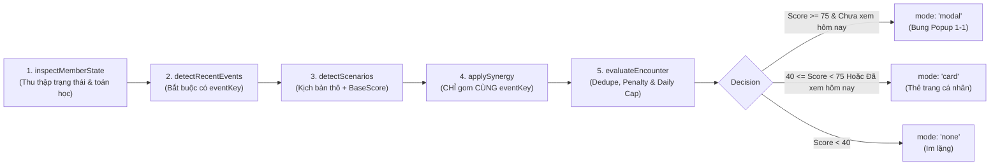

# HỆ THỐNG PERSONAL BOT & NPC SCENARIO ENGINE (CẨM NANG PHÁT TRIỂN)

> **Tài liệu chuẩn mực cho nhánh Bot (Bot Branch / Personal NPC)**  
> **Mục tiêu:** Giúp lập trình viên tiếp tục mở rộng tính năng, bổ sung kịch bản đối thoại hoặc tích hợp minigame mà **tuyệt đối không phá vỡ logic toán học, không làm sai lệch triết lý thiết kế và không gây spam người dùng**.  
> **Phiên bản Engine:** v2.3 (Session-Aware Freshness) · **Cập nhật:** 2026-09-23

---

## 1. TRIẾT LÝ CỐT LÕI (THE CORE PHILOSOPHY)

### 1.1 Tách Biệt Tuyệt Đối Giữa "Global Bot" và "Personal Bot"
Trong Badminclub, Bot tồn tại dưới hai tư cách hoàn toàn khác nhau. Khi code, bạn bắt buộc phải phân biệt rõ:

| Tiêu chí | Global Bot (Bot Thành viên CLB) | Personal Bot (Trợ lý / NPC Cá nhân) |
| :--- | :--- | :--- |
| **Định danh** | 1 bản ghi `club_members` có cờ `is_bot = true`. | Một lớp trải nghiệm tương tác đối thoại 1-1 với từng thành viên. |
| **Vai trò** | Đứng trên Bảng xếp hạng Elo, đánh minigame Arcade, làm đối thủ tham chiếu cho toàn CLB. | Nhân vật đồng hành, quan sát lịch sử thi đấu của riêng bạn để khen ngợi, cà khịa, gạ kèo, nhắc nợ. |
| **Hành vi** | Tự động quét CLB để tạo kèo đấu công khai (`create_bot_challenge`: Săn chuỗi, Sát nút BXH). | Bật Popup đối thoại (`BotEncounterModal.jsx`) hoặc hiện thẻ Card trong trang Thống kê cá nhân (`MyStats.jsx`). |
| **Mã nguồn** | [`src/lib/bot.js`](file:///c:/Workspace/badminclub/src/lib/bot.js) | [`src/lib/botScenarios.js`](file:///c:/Workspace/badminclub/src/lib/botScenarios.js) & [`src/lib/botMemory.js`](file:///c:/Workspace/badminclub/src/lib/botMemory.js) |

### 1.2 "Có Người Đang Nói Chuyện Với Mình" (Trải Nghiệm NPC Sống Động)
- Bot **không phải là chatbot AI tự do (LLM) trả lời linh tinh**, cũng **không phải là dòng thông báo hệ thống khô khan**.
- Bot là một **NPC có cá tính** (Competitive, Mocking, Praise, Mentor, Challenge) phản ứng chính xác theo các **biến động toán học có thật** của người chơi.
- Giao diện đối thoại mang tính nhập vai cao:
  - Avatar Bot có vầng hào quang chuyển màu theo sắc thái (*Tone Glow*).
  - Bong bóng thoại NPC (*Speech Bubble*) có mũi tên trỏ thẳng vào Bot.
  - Tone Badge thể hiện rõ thái độ (*"Gạ kèo"*, *"Cà khịa"*, *"Nể phục"*, *"Động viên"*).
  - Các nút hành động ngữ cảnh trực tiếp (*[Gạ kèo đòi nợ]*, *[Xem BXH]*, *[Đập cầu với Bot]*).

---

## 2. KIẾN TRÚC PIPELINE 5 BƯỚC ĐỘC LẬP (THE 5-STEP PIPELINE)

> ⛔ **LUẬT BẤT HỦ:** Tuyệt đối KHÔNG đập chung các bước vào một hàm khổng lồ. Mọi kịch bản mới phải đi qua đúng 5 trạm kiểm soát tuần tự sau:



### Bước 1: `inspectMemberState(db, memberId, now, memoryStore)`
- **Mục đích:** Thu thập toàn bộ dữ liệu tĩnh và động của thành viên.
- **Dữ liệu tính toán trước (Pre-computations):**
  - `preMatchElo`: Elo của người chơi ngay trước trận đấu gần nhất.
  - `preRank`: Thứ hạng toán học của người chơi ngay trước trận đấu gần nhất.
  - `rival`: Kình địch có nhiều trận đối đầu H2H nhất ($\ge 2$ trận).
  - `streakType` & `streakCount`: Chuỗi thắng hoặc chuỗi thua hiện tại.
  - `isRecentMatch`: Trận gần nhất có còn tươi mới theo lịch sinh hoạt CLB hay không (`isMatchSessionFresh`).

### Bước 2: `detectRecentEvents(db, memberId, state, now)`
- **Mục đích:** Phát hiện các sự kiện chuyển đổi trạng thái thực sự vừa diễn ra.
- 🚨 **BẮT BUỘC:** Mỗi sự kiện sinh ra phải có trường `eventKey` rõ ràng:
  - Nếu từ trận đấu: `eventKey = 'match:' + match.id`
  - Nếu từ bảng điểm/khoảng cách: `eventKey = 'standings:diff:' + diff`
  - Nếu từ arcade: `eventKey = 'arcade:' + round.id`

### Bước 3: `detectScenarios(events, state)`
- **Mục đích:** Ánh xạ từ sự kiện sang kịch bản đối thoại.
- Mỗi ứng viên (`candidate`) gồm: `scenarioKey`, `eventKey`, `baseScore`, `tone`, `lineKey`, `occurredAt`, `data`, `actions`.

### Bước 4: `applySynergy(candidates, state)`
- **Mục đích:** Khi một trận đấu tạo ra nhiều kỳ tích đồng thời (ví dụ: vừa chạm chuỗi 3 thắng, vừa vượt mặt kình địch), hệ thống sẽ gộp lại thành 1 kịch bản đặc biệt có điểm ưu tiên cực cao.
- 🚨 **LUẬT SYNERGY:** Chỉ được phép gộp các ứng viên có **CÙNG `eventKey`**. Tuyệt đối không gộp một sự kiện từ trận đấu hôm nay với một sự kiện bảng xếp hạng từ ngày hôm trước!

### Bước 5: `evaluateEncounter(candidates, memberId, now, memoryStore)`
- **Mục đích:** Chọn ra 1 kịch bản xuất sắc nhất và quyết định hình thức xuất hiện (`modal`, `card`, hoặc `none`).
- **Các bộ lọc:**
  1. *Penalty thời gian:* Càng xa thời điểm diễn ra, điểm càng bị trừ nhẹ.
  2. *Deduplication:* Trừ 25 điểm nếu kịch bản này đã từng xuất hiện trong 3 ngày qua (`hasShownRecently`).
  3. *Daily Modal Cap:* Nếu người này đã thấy 1 popup modal trong ngày hôm nay (`hasSeenModalToday`), tự động **hạ cấp xuống `mode: 'card'`**.

---

## 3. CƠ CHẾ SESSION-AWARE FRESHNESS (ĐẶC QUYỀN CHO LỊCH 2 BUỔI/TUẦN)

### 3.1 Vấn đề của đồng hồ 24 giờ thông thường
- CLB thường sinh hoạt cố định 2 buổi/tuần: **Thứ 6 & Chủ Nhật (mỗi buổi 2 tiếng)**.
- Người chơi đánh xong tối Chủ Nhật, Thứ 2 bận đi làm, tối Thứ 3 hoặc Thứ 4 mới mở app.
- Nếu dùng quy tắc "24 giờ": Trận Chủ Nhật đã bị coi là quá hạn $\rightarrow$ Bot câm lặng $\rightarrow$ Mất sạch cảm xúc gắn kết!

### 3.2 Thuật toán `isMatchSessionFresh`
Một trận đấu được xem là **Tươi Mới** để Bot phản ứng khi thỏa mãn đồng thời cả 4 điều kiện:
```javascript
export function isMatchSessionFresh(db, memberId, lastMatch, now, memoryStore) {
  // 1. Trần an toàn tối đa: Không quá 7 ngày
  const elapsed = now - matchAt
  if (elapsed < 0 || elapsed > 7 * 24 * 3600 * 1000) return false

  // 2. Chống lặp: Người này CHƯA TỪNG xem phản hồi về trận đấu này
  const matchKey = `match:${lastMatch.id}`
  if (memoryStore?.hasShownRecently(memberId, matchKey, 7, now)) return false

  // 3. Buổi tập tiếp theo của CLB CHƯA kết thúc (chưa closed và chưa qua ngày)
  if (nextSession && (nextSession.status === 'closed' || nowDate > nextSession.date)) {
    return false
  }

  // 4. Trong CLB chưa có buổi tập mới nào diễn ra sau trận này (> 6 tiếng)
  if (hasNewerSessionMatches) return false

  return true
}
```

$\implies$ **Hệ quả UX:** Lần đầu tiên người chơi mở app giữa tuần (Thứ 2, 3, 4), Bot sẽ lập tức xuất hiện chúc mừng/cà khịa trận Chủ Nhật. Ngay khi xem xong, hệ thống lưu vết `match:<id>` vào `BotMemoryStore`, các lần mở app hoặc F5 sau đó trong tuần sẽ không hiện lại nữa!

---

## 4. BỐN ĐIỀU KIỆN CHUYỂN ĐỔI TOÁN HỌC (CHUẨN XÁC, KHÔNG ĐOÁN MÒ)

Khi phát triển thêm logic, bạn phải tuân thủ nghiêm ngặt 4 công thức chuyển đổi sau:

### 4.1 Overtake (Vượt điểm) Toán học
Không đoán mò từ thứ hạng hiện tại, mà so sánh trực tiếp Elo trước và sau trận:
- **Người chơi vượt đối thủ B:**
  $$\text{preMatchElo} < \text{oppPreElo} \quad \text{VÀ} \quad \text{currentElo} \ge \text{oppPostElo}$$
- **Người chơi bị đối thủ B vượt:**
  $$\text{preMatchElo} > \text{oppPreElo} \quad \text{VÀ} \quad \text{currentElo} \le \text{oppPostElo}$$

### 4.2 Revenge Complete (Đòi Nợ Thành Công)
Không phải chỉ là "đối thủ này từng thắng tôi trong quá khứ". Một trận đấu được công nhận là **Đòi Nợ** khi:
1. Trận gần nhất (`lastMatch`) là **Trận Thắng** và diễn ra trong buổi gần nhất (`isRecentMatch`).
2. Trận đối đầu trực tiếp gần nhất trước đó với người này (`prevH2HMatch`) là **Trận Thua**.
3. Món nợ phải còn "nóng": Trận thua đó diễn ra cách trận hiện tại **không quá 6 trận của người chơi** (`MAX_REVENGE_MATCH_GAP = 6`, tương đương 1–2 buổi tập gần nhất). Đã đánh $>6$ trận khác xen giữa thì món nợ đã nguội, không kích hoạt kịch bản đòi nợ.

### 4.3 Chasing Bot (Bám Đuổi Sát Nút - Threshold Crossing)
Không kích hoạt lặp đi lặp lại mỗi ngày chỉ vì đang cách Bot 10 điểm. Chỉ kích hoạt khi **vừa bước qua ngưỡng**:
$$\text{preBotGap} > 15 \quad \text{VÀ} \quad 0 < \text{currentBotGap} \le 15$$
(Trận thắng vừa rồi đưa khoảng cách từ $>15$ điểm rút ngắn xuống còn $\le 15$ điểm).

### 4.4 Top 3 Entered (Bước Chân Vào Top 3)
Chỉ kích hoạt khi trước trận đang đứng ngoài Top 3 và nhờ trận thắng này leo vào Top 3:
$$\text{preRank} > 3 \quad \text{VÀ} \quad \text{currentRank} \le 3$$
(Nếu trước trận đã ở Rank 2 thắng lên Rank 1 thì KHÔNG kích hoạt `top3_entered`).

---

## 5. HƯỚNG DẪN TỪNG BƯỚC: THÊM MỘT SCENARIO MỚI

Giả sử bạn muốn thêm kịch bản mới: **"Thợ săn chuỗi - Đánh bại đối thủ đang có chuỗi thắng 5"** (`streak_breaker`). Hãy làm theo đúng quy trình 5 bước sau:

### Bước 1: Khai báo Event trong `detectRecentEvents` ([`src/lib/botScenarios.js`](file:///c:/Workspace/badminclub/src/lib/botScenarios.js))
```javascript
// Kiểm tra nếu trận gần nhất thắng một đối thủ đang có chuỗi thắng >= 4
if (state.lastMatchWon && state.isRecentMatch) {
  for (const oppId of state.lastOpponentIds) {
    const oppStreak = getMemberStreak(db, oppId) // hàm tính chuỗi
    if (oppStreak && oppStreak.type === 'won' && oppStreak.count >= 4) {
      events.push({
        type: 'streak_breaker',
        eventKey: `match:${state.lastMatch.id}`, // BẮT BUỘC
        occurredAt: state.lastMatchAt,
        data: { oppId, oppName: playerName(db, oppId), count: oppStreak.count },
      })
    }
  }
}
```

### Bước 2: Chuyển đổi thành Candidate Scenario trong `detectScenarios`
```javascript
case 'streak_breaker':
  candidates.push({
    scenarioKey: 'streak_breaker',
    eventKey: ev.eventKey, // Giữ nguyên eventKey
    baseScore: 88, // Điểm cao để ưu tiên bung modal
    tone: 'praise', // Sắc thái: ngợi khen
    lineKey: 'bot.encounter.lines.streak_breaker',
    occurredAt: ev.occurredAt,
    data: ev.data,
    actions: [
      { actionType: 'view_leaderboard', labelKey: 'bot.encounter.actions.viewRank' }
    ]
  })
  break
```

### Bước 3: Đăng ký câu thoại i18n trong [`src/i18n/vi.json`](file:///c:/Workspace/badminclub/src/i18n/vi.json)
> ⛔ **CẤM:** Không viết chữ tiếng Việt trực tiếp trong code.
```json
"bot": {
  "encounter": {
    "lines": {
      "streak_breaker": "Khét đấy! Chuỗi {{count}} trận bất bại của {{oppName}} đã bị chính tay bạn bẻ gãy! Cả CLB đang ngả mũ đấy!"
    }
  }
}
```

### Bước 4: Viết Unit Test Kiểm Định trong [`src/__tests__/lib/bot_scenarios.test.js`](file:///c:/Workspace/badminclub/src/__tests__/lib/bot_scenarios.test.js)
Tạo mock DB, giả lập trận đấu và assert:
```javascript
const events = detectRecentEvents(db, 'u1', state, NOW)
assert.ok(events.some(e => e.type === 'streak_breaker'), 'Phải phát hiện sự kiện cắt chuỗi đối thủ')
```

### Bước 5: Chạy Test Kiểm Tra Toàn Diện
```bash
node src/__tests__/lib/bot_scenarios.test.js
npm test
```
Tất cả 422+ tests phải PASS 100%.

---

## 6. NHỮNG ĐIỀU CẤM KỴ (WHAT NOT TO DO)

1. ❌ **CẤM sinh event không có `eventKey`:** Nếu thiếu `eventKey`, hệ thống synergy và chống trùng lặp bộ nhớ sẽ vỡ vụn.
2. ❌ **CẤM gom Synergy khác `eventKey`:** Không bao giờ gộp sự kiện diễn ra ở hai trận đấu khác nhau vào cùng một câu thoại.
3. ❌ **CẤM hard-code chữ:** Mọi câu nói của Bot, nhãn nút bấm, nhãn sắc thái bắt buộc phải nằm trong `src/i18n/vi.json`.
4. ❌ **CẤM phá vỡ Daily Modal Cap:** Không bao giờ bỏ qua bước kiểm tra `hasSeenModalToday`. Người chơi chỉ chấp nhận tối đa 1 Popup đối thoại mỗi ngày, các tin sau phải nằm ở dạng Card.
5. ❌ **CẤM tự ý sửa số liệu DB từ Bot:** Bot chỉ là một thành viên hoặc tầng UI đọc dữ liệu. Bot không bao giờ được tự ý trừ tiền, cộng điểm Elo ảo hay sửa dữ liệu trận đấu của người khác.

---

## 7. BẢN ĐỒ TỆP TIN NHÁNH BOT (BOT BRANCH FILE MAP)

| Tệp tin | Trách nhiệm |
| :--- | :--- |
| [`src/lib/botScenarios.js`](file:///c:/Workspace/badminclub/src/lib/botScenarios.js) | **Trái tim Engine:** Chứa 5 bước pipeline, tính toán preRank/preElo, Session-Aware Freshness và luật Synergy. |
| [`src/lib/botMemory.js`](file:///c:/Workspace/badminclub/src/lib/botMemory.js) | **Bộ nhớ Bot:** Lưu vết encounter vào `localStorage`, kiểm tra Daily Cap, deduplicate kịch bản và sự kiện. |
| [`src/lib/bot.js`](file:///c:/Workspace/badminclub/src/lib/bot.js) | **Global Bot:** Quản lý tài khoản Bot trong CLB, tạo kèo tự động (`create_bot_challenge`), tính điểm minigame Arcade. |
| [`src/components/bot/BotEncounterModal.jsx`](file:///c:/Workspace/badminclub/src/components/bot/BotEncounterModal.jsx) | **Giao diện Đối thoại 1-1:** Popup NPC đạt chuẩn TDMS, hào quang avatar, speech bubble, tone badge và action buttons. |
| [`src/components/home/personal/BotTauntCard.jsx`](file:///c:/Workspace/badminclub/src/components/home/personal/BotTauntCard.jsx) | **Thẻ Card Cá nhân:** Nơi hiển thị kịch bản Bot khi hạ cấp từ Modal (`mode: 'card'`). |
| [`src/pages/MyStats.jsx`](file:///c:/Workspace/badminclub/src/pages/MyStats.jsx) | **Điểm neo kích hoạt:** Màn hình thống kê cá nhân nơi gọi `getPersonalBotEncounter` và mở Modal. |
| [`src/__tests__/lib/bot_scenarios.test.js`](file:///c:/Workspace/badminclub/src/__tests__/lib/bot_scenarios.test.js) | **Bộ Unit Test:** 8 bộ test bao phủ toàn bộ các case toán học, freshness window và synergy. |
