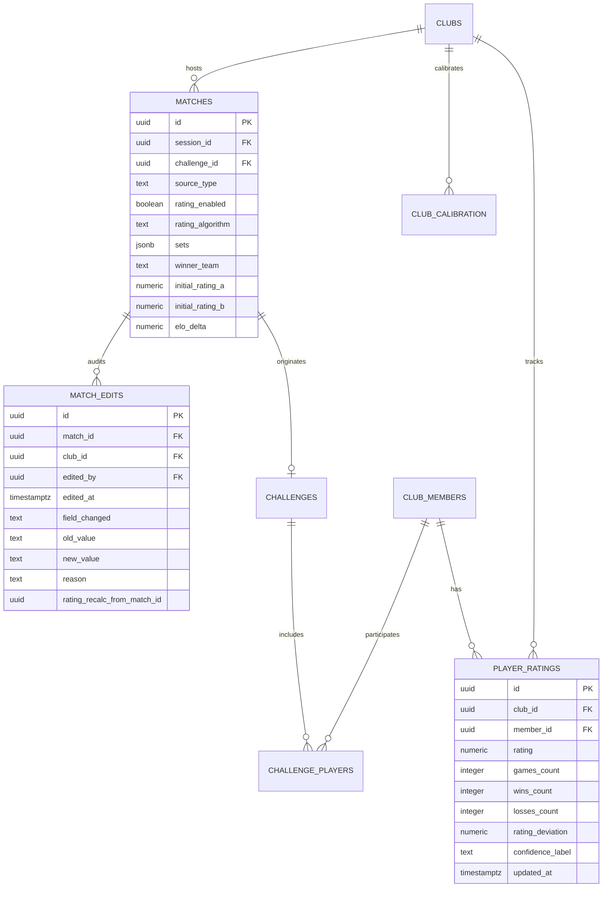

# HỆ THỐNG ĐIỂM ELO CAREER VÀ CƠ CHẾ ĐIỂM MÙA GIẢI (SEASON POINTS) — BADMINCLUB

> **Tài liệu kỹ thuật đặc tả kiến trúc, công thức toán học, cơ chế lưu trữ và tác động nghiệp vụ**  
> *Được trích xuất và chuẩn hoá trực tiếp từ mã nguồn thực tế của dự án BadminClub (`src/lib/rating.js`, `src/lib/xp.js`, `src/lib/assign.js`, `src/config/app.json`, `supabase/migrations/`).*

---

## MỤC LỤC

1. [Tổng quan kiến trúc: Mô hình 2 tầng điểm độc lập](#1-tổng-quan-kiến-trúc-mô-hình-2-tầng-điểm-độc-lập)
2. [Hệ thống Elo Career (Đo lường Trình độ Chuyên môn)](#2-hệ-thống-elo-career-đo-lường-trình-độ-chuyên-môn)
   - 2.1. [Điểm hạt giống ban đầu (Seed Rating)](#21-điểm-hạt-giống-ban-đầu-seed-rating)
   - 2.2. [Công thức xác suất thắng Elo](#22-công-thức-xác-suất-thắng-elo)
   - 2.3. [Hệ số biến thiên động K-Factor theo độ dày trận đấu (R1 → R5)](#23-hệ-số-biến-thiên-động-k-factor-theo-độ-dày-trận-đấu-r1--r5)
   - 2.4. [Hệ số cách biệt tỷ số (Margin of Victory Multiplier)](#24-hệ-số-cách-biệt-tỷ-số-margin-of-victory-multiplier)
   - 2.5. [Công thức tính biến thiên Elo (\Delta Elo) cho từng VĐV](#25-công-thức-tính-biến-thiên-elo-delta-elo-cho-từng-vđv)
   - 2.6. [Co cụm hạt nhân Bayes (Bayes Shrinkage) & Sức mạnh hiệu dụng](#26-co-cụm-hạt-nhân-bayes-bayes-shrinkage--sức-mạnh-hiệu-dụng)
   - 2.7. [Hệ thống phân hạng (8 Rank Tiers, 4 Bộ Theme & 10 Playstyle Badges)](#27-hệ-thống-phân-hạng-8-rank-tiers-4-bộ-theme--10-playstyle-badges)
   - 2.8. [Suy hao phong độ khi vắng mặt lâu ngày (Inactivity Decay)](#28-suy-hao-phong-độ-khi-vắng-mặt-lâu-ngày-inactivity-decay)
   - 2.9. [Máy học hiệu chỉnh chéo giới tính (Cross-Gender Calibration)](#29-máy-học-hiệu-chỉnh-chéo-giới-tính-cross-gender-calibration)
   - 2.10. [Đánh giá Elo theo Thể thức (Format Ratings: Đôi, Nam-Nữ, Đơn)](#210-đánh-giá-elo-theo-thể-thức-format-ratings-đôi-nam-nữ-đơn)
   - 2.11. [Phân tích Bạn đấu hợp nhất & Đối thủ kỵ giơ (Partners & Nemeses)](#211-phân-tích-bạn-đấu-hợp-nhất--đối-thủ-kỵ-giơ-partners--nemeses)
3. [Cơ chế Điểm Mùa giải (Season Points) & Cấp độ XP](#3-cơ-chế-điểm-mùa-giải-season-points--cấp-độ-xp)
   - 3.1. [Bảng điểm cộng Điểm Mùa chi tiết (Season Points)](#31-bảng-điểm-cộng-điểm-mùa-chi-tiết-season-points)
   - 3.2. [Cơ chế Vua Lì Đòn (Bounty Player)](#32-cơ-chế-vua-lì-đòn-bounty-player)
   - 3.3. [Quy tắc Reset điểm theo Quý (Quarterly Reset)](#33-quy-tắc-reset-điểm-theo-quý-quarterly-reset)
   - 3.4. [Hệ thống cấp độ và danh xưng XP tích lũy (Lifetime XP)](#34-hệ-thống-cấp-độ-và-danh-xưng-xp-tích-lũy-lifetime-xp)
4. [Cơ chế Lưu trữ Cơ sở dữ liệu & Tính lại Dây chuyền (Persistence & Cascade Recalculation)](#4-cơ-chế-lưu-trữ-cơ-sở-dữ-liệu--tính-lại-dây-chuyền-persistence--cascade-recalculation)
   - 4.1. [Lược đồ Cơ sở dữ liệu (Supabase Database Schema)](#41-lược-đồ-cơ-sở-dữ-liệu-supabase-database-schema)
   - 4.2. [Thuật toán Replay tính lại toàn bộ khi sửa hoặc huỷ trận (`replayRatingCascade`)](#42-thuật-toán-replay-tính-lại-toàn-bộ-khi-sửa-hoặc-huỷ-trận-replayratingcascade)
   - 4.3. [Sổ kiểm toán chỉnh sửa tỷ số (`match_edits`)](#43-sổ-kiểm-toán-chỉnh-sửa-tỷ-số-matchedits)
5. [Tác động toàn diện đến Thuật toán Chia sân (Matchmaking & Best-of-N)](#5-tác-động-toàn-diện-đến-thuật-toán-chia-sân-matchmaking--best-of-n)
   - 5.1. [5 Tiêu chí cân bằng trận đấu (Trọng số 35/20/15/15/15 & Tích hợp Synergy)](#51-5-tiêu-chí-cân-bằng-trận-đấu-trọng-số-3520151515--tích-hợp-synergy)
   - 5.2. [Thuật toán Monte Carlo Best-of-N (80 Phương án)](#52-thuật-toán-monte-carlo-best-of-n-80-phương-án)
   - 5.3. [Trực quan hoá Lineup, Highlight Slot và Danh sách chờ](#53-trực-quan-hoá-lineup-highlight-slot-và-danh-sách-chờ)
   - 5.4. [Mô phỏng đổi người What-If (`simulateWhatIfSwap`)](#54-mô-phỏng-đổi-người-what-if-simulatewhatifswap)
6. [Tác động đến Nghiệp vụ Trận đấu & Kèo đấu (Match & Challenge)](#6-tác-động-đến-nghiệp-vụ-trận-đấu--kèo-đấu-match--challenge)
   - 6.1. [Kèo thách đấu (Challenge) chuyển thành Trận đấu (Match)](#61-kèo-thách-đấu-challenge-chuyển-thành-trận-đấu-match)
   - 6.2. [Đóng băng Elo tại thời điểm bắt đầu trận](#62-đóng-băng-elo-tại-thời-điểm-bắt-đầu-trận)
   - 6.3. [Các chế độ trận: Bo1, Bo3, Unrated (Đánh tập)](#63-các-chế-độ-trận-bo1-bo3-unrated-đánh-tập)
7. [Tác động đến Bảng xếp hạng (Leaderboard)](#7-tác-động-đến-bảng-xếp-hạng-leaderboard)
   - 7.1. [Cấu trúc 6 Tab Bảng Xếp Hạng](#71-cấu-trúc-6-tab-bảng-xếp-hạng)
   - 7.2. [Khu vực Thẩm định Trình độ (Provisional R1)](#72-khu-vực-thẩm-định-trình-độ-provisional-r1)
   - 7.3. [Công thức Ăn ý, Khắc chế & Đối đầu cặp (Synergy & Matchup)](#73-công-thức-ăn-ý-khắc-chế--đối-đầu-cặp-synergy--matchup)
   - 7.4. [Ma trận Đối đầu H2H N×N & Gợi ý Gạ kèo (`neverMetWithSessionCount`)](#74-ma-trận-đối-đầu-h2h-nn--gợi-ý-gạ-kèo-nevermetwithsessioncount)
   - 7.5. [Công cụ Tìm kiếm Trận đấu Đa chiều (`filterMatches`)](#75-công-cụ-tìm-kiếm-trận-đấu-đa-chiều-filtermatches)
8. [Bảng tổng hợp tham chiếu cấu hình (`app.json`)](#8-bảng-tổng-hợp-tham-chiếu-cấu-hình-appjson)
---

## 1. TỔNG QUAN KIẾN TRÚC: MÔ HÌNH 2 TẦNG ĐIỂM ĐỘC LẬP

Để giải quyết mâu thuẫn muôn thuở của các câu lạc bộ thể thao phong trào: *"Người đánh giỏi nhưng lười đi thì đứng đầu bảng, còn người mới tập nhưng đi đều đặn, cống hiến hết mình lại đứng chót"*, BadminClub vận hành mô hình **Hai tầng điểm song song, hoàn toàn độc lập về mặt ngữ nghĩa và vòng đời**:

```
                               ┌─────────────────────────────────────────┐
                               │       BADMINCLUB DUAL-TIER ENGINE       │
                               └────────────────────┬────────────────────┘
                                                    │
                   ┌────────────────────────────────┴────────────────────────────────┐
                   ▼                                                                 ▼
      ┌─────────────────────────┐                                       ┌─────────────────────────┐
      │   TẦNG 1: ELO CAREER    │                                       │  TẦNG 2: SEASON POINTS  │
      │   (Trình độ Chuyên môn)  │                                       │   (Cống hiến & Phong trào)│
      ├─────────────────────────┤                                       ├─────────────────────────┤
      │ • Thước đo thực lực     │                                       │ • Thước đo chuyên cần   │
      │ • CỘNG khi thắng        │                                       │ • CHỈ CỘNG, KHÔNG TRỪ   │
      │ • TRỪ khi thua          │                                       │ • Điểm danh, ra sân     │
      │ • VĨNH VIỄN theo thời gian│                                     │ • RESET VỀ 0 MỖI QUÝ    │
      │ • Phục vụ CHIA SÂN      │                                       │ • Phục vụ ĐUA TOP QUÝ   │
      └─────────────────────────┘                                       └─────────────────────────┘
```

- **Tầng 1: Elo Career**: Đại diện cho đẳng cấp cầu lông thuần túy. Thắng được cộng, thua bị trừ. Điểm tích lũy xuyên suốt lịch sử CLB, không bao giờ reset về 0.
- **Tầng 2: Điểm Mùa giải (Season Points & XP)**: Đo lường mức độ gắn bó, tham gia và nhiệt huyết trong một mùa (chu kỳ 1 quý: 3 tháng). Điểm này **chỉ cộng, không bao giờ trừ**. Hết quý, Điểm Mùa sẽ reset về 0 để mở cuộc đua mới.

---

## 2. HỆ THỐNG ELO CAREER (ĐO LƯỜNG TRÌNH ĐỘ CHUYÊN MÔN)

*(File nguồn: `src/lib/rating.js`, cấu hình `src/config/app.json`)*

### 2.1. Điểm hạt giống ban đầu (Seed Rating)

Khi một thành viên mới gia nhập CLB hoặc khi hệ thống kích hoạt tính năng tính điểm lần đầu, người chơi chưa có bất kỳ trận đấu nào. Thay vì gán điểm 0 hay một con số ngẫu nhiên, hệ thống sử dụng hàm `initialRatingOf(level, levels)` để gán điểm hạt giống (Seed Rating) dựa vào cấp độ tự khai hoặc thẩm định ban đầu:

| Cấp độ người chơi (Level) | Từ khoá nhận diện | Điểm Seed ban đầu | Ghi chú |
| :--- | :--- | :---: | :--- |
| **Yếu / Newbie** | `yeu`, `y`, `newbie` | **200** | Mới cầm vợt, chưa vững bộ |
| **Yếu +** | `y+` | **250** | Đã biết phát cầu và đánh qua lưới |
| **Trung bình yếu -** | `tby-` | **300** | |
| **Trung bình yếu** | `tby` | **350** | |
| **Trung bình yếu +** | `tby+` | **400** | |
| **Trung bình -** | `tb-` | **450** | |
| **Trung bình (Mặc định)** | `tb`, `trung binh` | **500** | Đánh đều cầu, phông ve cơ bản |
| **Trung bình +** | `tb+` | **650** | Bắt đầu có lực đập và cắt cầu |
| **Trung bình khá** | `tbk` | **720** | Di chuyển tốt, chiến thuật đôi ổn |
| **Khá** | `kha`, `k` | **800** | Tấn công tốt, phản xạ nhanh |
| **Tốt / Giỏi / Pro** | `tot`, `gioi`, `pro` | **1000** | Bán chuyên, cựu tuyển thủ |
| **Mặc định khác** | *Không rõ* | **200** | Fallback nếu không có dữ liệu |

*Thuật toán nội suy:* Nếu CLB tuỳ biến danh sách trình độ riêng trong `db.levels` (ví dụ 10 bậc), hệ thống tự động ánh xạ theo công thức nội suy tuyến tính:
$$\text{Seed} = \text{round}\left(200 + \frac{\text{index}}{\text{length} - 1} \times (1000 - 200)\right)$$

---

### 2.2. Công thức xác suất thắng Elo

Điểm của một đội $A$ gồm 2 thành viên ($p_1, p_2$) là trung bình cộng Elo của 2 người:
$$R_A = \text{round}\left(\frac{R_{p_1} + R_{p_2}}{2}\right)$$

Xác suất chiến thắng kỳ vọng $E_A$ của đội $A$ trước đội $B$ được tính theo hàm logistic chuẩn Elo thế giới:
$$E_A = \frac{1}{1 + 10^{\frac{R_B - R_A}{400}}}$$
$$E_B = 1 - E_A$$

*Ý nghĩa số học:*
- Nếu $R_A = R_B \implies E_A = 50\%$.
- Nếu $R_A - R_B = 120$ điểm $\implies E_A \approx 66.7\%$ (Kèo hơi lệch).
- Nếu $R_A - R_B = 250$ điểm $\implies E_A \approx 80.8\%$ (Kèo rất lệch - Imbalanced).
- Nếu $R_A - R_B = 400$ điểm $\implies E_A \approx 90.9\%$ (Chênh lệch quá lớn).

---

### 2.3. Hệ số biến thiên động K-Factor theo độ dày trận đấu (R1 → R5)

Hệ thống **không áp dụng một hệ số K cào bằng** cho tất cả mọi người. Người mới cần điểm dao động nhanh để về đúng trình thật; trong khi các tay vợt kỳ cựu cần số điểm ổn định, không bị tụt dốc thê thảm chỉ vì một trận không may "cõng tạ".

Hàm `kFactorOf(gamesCount)` phân bổ hệ số K cá nhân theo 5 bậc độ tin cậy:

| Bậc độ tin cậy | Số trận đã đấu | Hệ số K | Tác động thực tế |
| :---: | :---: | :---: | :--- |
| **R1 (Thẩm định - Low)** | $< 5$ trận | **48** | Điểm biến thiên cực mạnh ($\pm 24 \to \pm 40$). Nhanh chóng đưa tay vợt về đúng thực lực chỉ sau 1–2 buổi. |
| **R2 (Sơ khởi - Medium)** | $5 - 14$ trận | **36** | Điểm bắt đầu thu hẹp biên độ, xác định cận trên/dưới. |
| **R3 (Ổn định - High)** | $15 - 29$ trận | **28** | Trình độ tương đối chính xác, bắt đầu dùng làm căn cứ chia sân chuẩn. |
| **R4 (Kỳ cựu)** | $30 - 49$ trận | **20** | Điểm vững vàng, biến động vừa phải. |
| **R5 (Vững như bàn thạch - Very High)** | $\ge 50$ trận | **16** | Độ tin cậy tối đa. Mỗi trận chỉ thay đổi khoảng $\pm 4 \to \pm 10$ điểm. |

---

### 2.4. Hệ số cách biệt tỷ số (Margin of Victory Multiplier)

Trong cầu lông, một trận thắng $21\text{–}19$ (sát nút nghẹt thở) phản ánh thực lực hai bên ngang ngửa hơn rất nhiều so với một trận thắng huỷ diệt $21\text{–}3$ hay $21\text{–}5$.

Hàm `marginMultiplier(sets)` thưởng thêm điểm cho những chiến thắng áp đảo và giảm mức trừ đối với những trận thua suýt soát:

$$\text{avgDiff} = \frac{\sum_{i=1}^{n} |S_{A,i} - S_{B,i}|}{n}$$
$$\text{mult} = \min\left(1.40, \max\left(1.00, 1 + \frac{\text{avgDiff}}{40}\right)\right)$$

*Ví dụ minh hoạ:*
- Tỷ số $21\text{–}19$ (cách biệt 2 quả): $\text{mult} = 1 + \frac{2}{40} = 1.05$ (Gần như không nhân thêm).
- Tỷ số $21\text{–}13$ (cách biệt 8 quả): $\text{mult} = 1 + \frac{8}{40} = 1.20$ (Tăng 20% lượng Elo thay đổi).
- Tỷ số $21\text{–}5$ (cách biệt 16 quả): $\text{mult} = 1 + \frac{16}{40} = 1.40$ (Chạm trần tối đa $1.4\times$).

---

### 2.5. Công thức tính biến thiên Elo ($\Delta$ Elo) cho từng VĐV

Khi một trận đấu kết thúc, hệ thống duyệt qua từng người chơi và tính toán lượng biến thiên $\Delta$ cá nhân hoá bằng hàm `calcPlayerDeltas`:

$$\Delta_i = \text{round}\left(K_i \times (S_i - E_{\text{Team}}) \times \text{mult}\right)$$

Trong đó:
- $S_i = 1$ nếu đội của người chơi giành chiến thắng chung cuộc; $S_i = 0$ nếu thua.
- $E_{\text{Team}}$ là xác suất thắng dự kiến của đội người chơi đó.
- $K_i$ là hệ số K riêng của chính người chơi đó (dựa vào số trận tích luỹ của họ).
- $\text{mult}$ là hệ số cách biệt tỷ số của toàn bộ trận đấu.

**Quy tắc giới hạn an toàn (Floor Rating):**  
$$R_{\text{mới}} = \max(\text{MIN\_RATING}, R_{\text{cũ}} + \Delta_i) \quad \text{với } \text{MIN\_RATING} = 0$$
*Không có thành viên nào bị âm điểm Elo.*

---

### 2.6. Co cụm hạt nhân Bayes (Bayes Shrinkage) & Sức mạnh hiệu dụng

> **Bài toán thực tế:** Một thành viên mới vào CLB (Seed 300) may mắn thắng liền 3 trận đầu trước những người mệt mỏi. Điểm Elo kỹ thuật vọt lên 480. Nếu thuật toán chia sân bốc người này vào sân bảng A (nhóm 500-600) thì trận đấu tiếp theo sẽ "vỡ sân" vì người này thực chất trình độ chưa vững.

Để giải quyết triệt để vấn đề này, BadminClub triển khai cơ chế **Bayes Shrinkage** thông qua hàm `effectiveStrengthOf(rating, seedRating, gamesCount)`. Thay vì dùng Elo trần, hệ thống tính **Điểm Sức Mạnh Hiệu Dụng (Effective Strength)**:

$$\text{EffectiveStrength} = \text{round}\left(\text{Seed} \times W_{\text{seed}} + \text{Elo} \times (1 - W_{\text{seed}})\right)$$

| Trạng thái thẩm định | Số trận đã đấu | Trọng số Seed ($W_{\text{seed}}$) | Trọng số Elo thực | Ý nghĩa nghiệp vụ |
| :--- | :---: | :---: | :---: | :--- |
| **Giai đoạn Thẩm định (Provisional)** | $< 5$ trận | **60%** | **40%** | Co mạnh về điểm khai báo ban đầu. Ngăn chặn hiện tượng Elo "ảo" do chuỗi may mắn ngắn hạn. |
| **Giai đoạn Hoàn thiện** | $5 - 14$ trận | **35%** | **65%** | Bắt đầu tin tưởng kết quả thực tế trên sân. |
| **Giai đoạn Trưởng thành** | $15 - 29$ trận | **15%** | **85%** | Elo thể hiện 85% thực lực. |
| **Độ tin cậy Hoàn toàn** | $\ge 30$ trận | **0%** | **100%** | Tin tưởng tuyệt đối 100% điểm Elo trên sân. |

---

### 2.7. Hệ thống phân hạng (8 Rank Tiers, 4 Bộ Theme & 10 Playstyle Badges)

Hệ thống tự động xếp hạng thành viên vào 8 bậc Rank dựa trên điểm Elo hiện tại:

```
[0 ──────── 200 ──────── 400 ──────── 600 ──────── 800 ──────── 1000 ─────── 1200 ─────── 1400 ─────── ∞]
  Novice      Rookie      Regular     Solid      Net Master   Coverage    Heavy Hitter   Court Boss
```

Bảng danh xưng chuẩn theo 4 Bộ Theme (`src/data/rankThemes.json`):

| Key | Khoảng Elo | Token | Icon | Bộ 1: Dân Chơi Khét Tiếng (`street`) | Bộ 2: Tấu Hài Sân Cầu (`comedy`) | Bộ 3: Cỗ Máy Hủy Diệt (`destroyer`) | Bộ 4: Sân Cầu Thực Chiến (`slang`) |
| :--- | :---: | :--- | :---: | :--- | :--- | :--- | :--- |
| `novice` | 0 – 199 | `--rank-novice` | ✨ | **Tập Sự** | Bậc Thầy Đứng Nhìn | Kẻ Hủy Diệt Không Khí | Mới Cầm Vợt |
| `rookie` | 200 – 399 | `--rank-rookie` | 🏸 | **Có Tiềm Năng** | Chuyên gia vồ hụt | Chúa Tể Cạch Khung | Vào Sân |
| `regular` | 400 – 599 | `--rank-regular` | 🛡️ | **Cũng Ra Gì** | Thợ Múa Đường Cầu | Vua Phá Lưới | Quen Sân |
| `solid` | 600 – 799 | `--rank-solid` | ⚔️ | **Không Phải Dạng Vừa** | Đại Sứ Giao Cầu | Thần Đồng Cày Sân | Cứng Tay |
| `net_master` | 800 – 999 | `--rank-net-master`| ⚡ | **Có Số Má** | Chuyên Gia Mớm Cầu | Kẻ Hủy Diệt Lông Ngỗng | Khó Lói |
| `coverage` | 1000 – 1199 | `--rank-coverage` | 🔥 | **Có Tiếng** | Thợ Săn Rùa | Cỗ Máy Đứt Cước | Bao Sân |
| `heavy_hitter`| 1200 – 1399 | `--rank-heavy-hitter`| 🏆 | **Chưa Biết Sợ** | Chúa Tể Phản Tạt | Trùm Bào Thể Lực | Tay To |
| `court_boss` | 1400+ | `--rank-court-boss`| 👑 | **Thấy Là Chạy** | Máy Đập Bằng Cơm | Kẻ Phá Giá Giải Đấu | Trùm Sân |

*Hệ thống câu châm biếm hài hước (`comedyQuips`):* Mỗi bậc rank có một câu mô tả dí dỏm đặc trưng (VD: Novice — *"Cầu rơi sát chân vẫn đứng khoanh tay ngó xem nó trong hay ngoài"*; Court Boss — *"Bật cao như lò xo, trận nào cũng đập rách cầu, đứt cước làm đối thủ khiếp vía"*).

#### Hệ thống 10 Huy hiệu Lối chơi (Playstyle Badges)
Mỗi thành viên được định danh một huy hiệu lối chơi duy nhất bằng hàm băm tất định `getMemberBadge(memberId)`:

| Tag | Tên Huy hiệu | Icon | Mô tả tính cách |
| :--- | :--- | :---: | :--- |
| `VỒ HỤT` | **Chuyên Gia Vồ Hụt** | ⚡ | Rình trên lưới như mãnh thú nhưng toàn vồ trúng không khí. |
| `THỂ LỰC` | **Thánh lau sàn** | 🏃 | Cứu cầu như thợ lặn chuyên nghiệp, trượt thảm mòn cả đầu gối. |
| `TÂM LÝ CHIẾN` | **Hề Chúa Sân Cầu** | ✨ | Kỹ năng đánh cầu thì ít, nhưng tấu hài gây cười làm đội bạn mất tập trung thì vô địch. |
| `TRANH CÃI` | **Chích chòe** | ⚖️ | Cầu ra ngoài 2 mét vẫn khẳng định như đinh đóng cột là cầu trong sân. |
| `TRANG BỊ` | **Đại Gia Đổi Vợt** | 🏆 | Cứ đánh hỏng 1 quả là đổi vợt khác, đổ lỗi vợt chưa căng đủ ký. |
| `DƯỠNG SINH` | **Đại Sứ Khởi Động** | 🏋️ | Khởi động ép dẻo xoay khớp cả tiếng đồng hồ, vào đánh đúng 1 set là chuột rút. |
| `ĐỒNG ĐỘI` | **Thần Tài Chia Sân** | 🎖️ | Bao sân bạn thì ít mà bỏ trống nửa sân mình thì nhiều, nhường hết phần gánh cho đồng đội. |
| `PHÒNG THỦ` | **Bức Tường Bê Tông** | 🛡️ | Cầu đập mạnh như đạn bắn qua vẫn kê đẩy nhẹ nhàng trả về sân đối thủ. |
| `LẬT KÈO` | **Chúa Lội Ngược Dòng** | 👑 | Bị dẫn trước 15-20 vẫn bình chân như vại, ăn liền 7 điểm lật kèo ngoạn mục. |
| `SÁT THƯƠNG` | **Sát Thủ Bắn Chim** | 🎯 | Đập cầu uy lực kinh hoàng nhưng điểm rơi toàn nằm trên trần nhà hoặc nóc nhà thi đấu. |

---

### 2.8. Suy hao phong độ khi vắng mặt lâu ngày (Inactivity Decay)

*(Hàm `applyInactivityDecay(rating, lastMatchAt, asOfDate)`)*

Khi thành viên nghỉ tập quá lâu, cảm giác cầu và thể lực giảm sút. Hệ thống áp dụng quy tắc suy hao phong độ để giữ bảng xếp hạng luôn trung thực:
- **Dưới 30 ngày:** Trạng thái hoạt động bình thường (`isInactive = false`, `decay = 0`).
- **Từ 30 đến 44 ngày:** Hệ thống gắn cờ cảnh báo vắng mặt (`isInactive = true`, `decay = 0`), chưa trừ điểm.
- **Từ 45 ngày trở lên:** Bắt đầu trừ **10 điểm** Elo cho mỗi chu kỳ 30 ngày vắng tiếp theo:
$$\text{periods} = \left\lfloor \frac{\text{daysInactive} - 45}{30} \right\rfloor + 1$$
$$\text{totalDecay} = \text{periods} \times 10$$
$$\text{decayedRating} = \max(\text{MIN\_RATING}, \text{currentRating} - \text{totalDecay})$$

---

### 2.9. Máy học hiệu chỉnh chéo giới tính (Cross-Gender Calibration)

*(Hàm `computeClubCalibration`, `effectiveRating`)*

Trong các trận đánh đôi có sự kết hợp giữa Nam và Nữ, các thuật toán thông thường thường gặp khó khăn trong việc dự đoán do chênh lệch thể lực tự nhiên. Thay vì áp đặt một hằng số chủ quan, BadminClub tích hợp **mô hình tự học từ dữ liệu thực tế của CLB**:
1. Hệ thống lọc tất cả các trận đấu chéo giới tính trong quá khứ (đội có Nữ gặp đội toàn Nam).
2. Phân nhóm theo 3 dải khoảng cách Elo: `< 100`, `100–300`, `> 300`.
3. Tính toán tỷ lệ thắng thực tế của phe Nữ ($\text{observedWinRate}$).
4. Khi cỡ mẫu đạt tối thiểu 5 trận ($\text{sampleSize} \ge 5$), hệ thống tự động suy diễn ra hệ số hiệu chỉnh:
$$\text{learnedAdjustment} = \text{round}\left((\text{observedWinRate} - 0.50) \times 200\right)$$
5. Khi chia sân hoặc dự đoán kèo chéo giới tính, điểm hiệu dụng của thành viên Nữ sẽ được tự động cộng thêm $\text{learnedAdjustment}$ để đảm bảo độ cân bằng tối ưu trên lưới.


---

### 2.10. Đánh giá Elo theo Thể thức (Format Ratings: Đôi, Nam-Nữ, Đơn)

*(Hàm `getPlayerFormatRatings` trong `src/lib/rating.js`)*

Mỗi thành viên có sở trường khác nhau (người đánh đôi nam rất hay nhưng đôi nam-nữ lại vụng về, hoặc chuyên đánh đơn). Hệ thống phân tách lịch sử thi đấu thành 3 nhánh thể thức độc lập:
- **Đôi (`doubles`):** Gồm Đôi Nam và Đôi Nữ.
- **Đôi Nam-Nữ (`mixed`):** Trận đấu mà mỗi đội có đủ 1 Nam và 1 Nữ.
- **Đơn (`singles`):** Trận đấu 1 vs 1.

Điểm Elo của từng thể thức được ngoại suy từ điểm Elo Career kết hợp với tỷ lệ thắng thực tế của thể thức đó qua công thức Co cụm Bayes:
$\text{rawDelta} = (\text{winRate} - 0.50) \times 300$
$\text{weight} = \min\left(0.85, \frac{\text{gamesCount}}{30}\right)$
$R_{\text{format}} = \text{round}\left(R_{\text{career}} + \text{rawDelta} \times \text{weight}\right)$
- Khi số trận thể thức còn ít ($< 5$), điểm được gắn cờ thẩm định (`isProvisional = true`).
- Khi tích luỹ đủ 30 trận, trọng số đạt mức tối đa 85%, phản ánh năng lực chuyên biệt của thành viên ở thể thức đó.

---

### 2.11. Phân tích Bạn đấu hợp nhất & Đối thủ kỵ giơ (Partners & Nemeses)

*(Hàm `getPlayerPartnersAndMatchups` trong `src/lib/rating.js`)*

Hệ thống tự động rà soát toàn bộ lịch sử đấu của một cá nhân để xác định 3 nhóm nhân tố quan trọng phục vụ phân tích hồ sơ VĐV (Screen AY3):
1. **Bạn đấu hợp nhất (Best Partners):** Các đồng đội từng đứng cặp, được xếp hạng theo `synergyScore` giảm dần (kết hợp số trận). Giúp nhận diện cặp đôi vàng của CLB.
2. **Đối thủ ưa thích (Favorite Opponents):** Những đối thủ mà thành viên có tỷ lệ thắng vượt kỳ vọng ($\text{matchupImpact} \ge 0$).
3. **Đối thủ kỵ giơ nhất (Nemeses):** Những đối thủ mà thành viên thường xuyên thất bại dưới mức kỳ vọng ($\text{matchupImpact} < 0$), được sắp xếp theo tỷ lệ thắng thực tế thấp nhất. Giúp gợi ý các cặp đấu đầy duyên nợ.
---

## 3. CƠ CHẾ ĐIỂM MÙA GIẢI (SEASON POINTS) & CẤP ĐỘ XP

*(File nguồn: `src/lib/xp.js`, cấu hình `season.pointsConfig` trong `src/config/app.json`)*

Khác với Elo Career (thước đo kỹ thuật), **Điểm Mùa giải (Season Points)** là phần thưởng vinh danh sự cống hiến, độ chuyên cần và tinh thần chiến đấu của các thành viên.

### 3.1. Bảng điểm cộng Điểm Mùa chi tiết

| Hành động / Thành tích | Điểm Mùa cộng | Mã cấu hình | Điều kiện & Cơ chế kích hoạt |
| :--- | :---: | :--- | :--- |
| **Điểm danh có mặt buổi tập** | **+30 điểm** | `attendance` | Thành viên có trạng thái "Có mặt" trong buổi tập của CLB. |
| **Ra sân thi đấu mỗi trận** | **+10 điểm** | `matchPlayed` | Đứng tên thi đấu hoàn thành 1 trận đấu hợp lệ (dù thắng hay thua). |
| **Giành chiến thắng trận đấu** | **+15 điểm** | `matchWon` | Thắng chung cuộc trong trận đấu (được cộng gộp với 10 điểm ra sân $\to$ tổng +25). |
| **Hạ gục đối thủ Elo cao hơn (Upset)** | **+25 điểm** | `upsetWon` | Thắng đội có Elo trung bình cao hơn đội mình $\ge 100$ điểm (`match.upsetMinGap`). |
| **Trận đấu 3 set kịch tính (Thriller)** | **+10 điểm** | `threeSets` | Trận đấu kéo dài đủ 3 set đấu căng thẳng (bất kể thắng hay thua). |
| **Chuỗi 3 trận thắng liên tiếp (Streak)** | **+20 điểm** | `streakThree` | Mỗi block 3 trận thắng liên tiếp trong mùa: $\lfloor \frac{\text{streak}}{3} \rfloor \times 20$. |

> **Ví dụ thực tế một kịch bản hoàn hảo:**  
> Thành viên A đi tập buổi tối:
> - Có mặt điểm danh: **+30 điểm**
> - Ra sân trận 1: Đánh 3 set kịch tính, lội ngược dòng hạ đối thủ Elo cao hơn 150 điểm:
>   - Ra sân: $+10$
>   - Thắng trận: $+15$
>   - Lật kèo Upset: $+25$
>   - Đánh đủ 3 set: $+10$  
>   $\implies$ Riêng trận này mang về **+60 điểm Mùa**!
> - Đạt chuỗi 3 trận thắng liên tiếp trong buổi: Thưởng thêm **+20 điểm Mùa**!

---

### 3.2. Cơ chế Vua Lì Đòn (Bounty Player)

*(Hàm `getSeasonBountyPlayer(db)`)*

Để tạo kịch tính cho các buổi tập, hệ thống tự động quét toàn bộ CLB để tìm ra **VĐV đang nắm giữ chuỗi thắng dài nhất hiện tại** ($\text{streak} \ge 3$ trận gần nhất):
- VĐV này sẽ được gắn huy hiệu **Bounty Player** (Mục tiêu săn thưởng vinh danh).
- Khi đối đầu và hạ gục đội có người đang giữ chuỗi thắng hoặc rating cao hơn $\ge 100$ Elo, người thắng sẽ được thưởng điểm **Lật kèo (Upset)** (+25 Điểm Mùa, +30 XP).
- Thành tích chuỗi thắng được hiển thị trực tiếp trên thẻ VĐV và Bảng xếp hạng để kích thích phong trào "săn thưởng" trong buổi tập.

---

### 3.3. Quy tắc Reset điểm theo Quý (Quarterly Reset)

- **Chu kỳ mùa giải:** Chu kỳ chuẩn là 1 Quý (3 tháng). Ví dụ: Mùa 3/2026 diễn ra từ `2026-07-01` đến `2026-09-30`.
- **Thời điểm đóng mùa:** Đúng `23:59:59` ngày cuối cùng của quý:
  1. Chốt danh hiệu vô địch Mùa giải (Quán quân, Á quân, Vua Upset, Vua Chuyên Cần).
  2. Trao Huy chương ảo và lưu trữ thành tựu vào lịch sử cá nhân vĩnh viễn.
  3. **RESET TOÀN BỘ ĐIỂM MÙA GIẢI (SEASON POINTS) VỀ 0** cho tất cả thành viên để bắt đầu mùa mới.
  4. **TUYỆT ĐỐI KHÔNG RESET ELO CAREER:** Toàn bộ điểm Elo, hệ số K và lịch sử đấu chuyên môn được giữ nguyên vẹn 100%.

---

### 3.4. Hệ thống cấp độ và danh xưng XP tích lũy (Lifetime XP)

*(File nguồn: `src/lib/xp.js` — các hàm `calculateMemberXp`, `titleOfLevel`, `getMemberXpLedger`)*

Khác với Điểm Mùa (reset mỗi quý), **XP Tích Lũy Trọn Đời (Lifetime XP)** không bao giờ reset, đo lường toàn bộ thời gian gắn bó và cống hiến của thành viên với CLB.

#### Bảng quy đổi tích lũy Lifetime XP (`calculateMemberXp`)
| Hoạt động | XP Cộng | Ghi chú |
| :--- | :---: | :--- |
| **Mỗi buổi tham gia điểm danh** | **+50 XP** | Cao hơn điểm mùa (+30) nhằm tôn vinh độ bền bỉ |
| **Mỗi trận ra sân thi đấu** | **+10 XP** | Dù thắng hay thua |
| **Trận 3 set kịch tính** | **+20 XP** | Gấp đôi điểm mùa (+10) vì tiêu hao thể lực |
| **Hạ đối thủ Elo cao hơn (Upset)** | **+30 XP** | Phần thưởng cho nỗ lực vượt khó |
| **Thưởng thâm niên cơ bản** | **+15 XP/trận** | $\max(0, \text{historicalGames} - \text{matchCount}) \times 15$ |

#### Công thức Cấp độ (Level) và 6 Bậc Danh Xưng
$\text{Level} = \left\lfloor \frac{\text{TotalXP}}{600} \right\rfloor + 1$

- Mỗi Level yêu cầu chính xác **600 XP**.
- Tiến trình trong Level: $\text{progress} = \text{round}\left(\frac{\text{TotalXP} \pmod{600}}{600} \times 100\right)\%$.

| Cấp độ (Level) | Danh xưng (Title) | Điểm XP tích lũy tương ứng |
| :---: | :--- | :--- |
| **Lv 1 – 4** | **Tân thủ** | 0 – 2,399 XP |
| **Lv 5 – 9** | **Tập sự** | 2,400 – 5,399 XP |
| **Lv 10 – 14** | **Quen sân** | 5,400 – 8,399 XP |
| **Lv 15 – 19** | **Thực chiến** | 8,400 – 11,399 XP |
| **Lv 20 – 24** | **Hảo thủ** | 11,400 – 14,399 XP |
| **Lv 25+** | **Cao thủ** | $\ge 14,400$ XP |
---

## 4. CƠ CHẾ LƯU TRỮ CƠ SỞ DỮ LIỆU & TÍNH LẠI DÂY CHUYỀN (PERSISTENCE & CASCADE RECALCULATION)

*(File nguồn: `supabase/migrations/0021_challenge_and_rating.sql`, `src/contexts/appActions.js`)*

### 4.1. Lược đồ Cơ sở dữ liệu (Supabase Database Schema)

Hệ thống lưu trữ trạng thái điểm và lịch sử qua 6 bảng cơ sở dữ liệu quan hệ chặt chẽ:



Chi tiết các trường cốt lõi:
1. `player_ratings`:
   - `rating`: Điểm Elo career hiện tại (số thực).
   - `games_count`, `wins_count`, `losses_count`: Tổng số trận, thắng, thua tính theo Elo.
   - `confidence_label`: Bậc tin cậy hiện tại (`low`, `medium`, `high`, `very_high`).
   - `rating_deviation`: Độ lệch chuẩn (mặc định 350, thu hẹp dần qua các trận).
2. `matches`:
   - `sets`: Mảng JSON các set điểm, ví dụ `[[21, 19], [18, 21], [21, 15]]`.
   - `winner_team`: Đội thắng (`A` hoặc `B`).
   - `initial_rating_a`, `initial_rating_b`: Điểm Elo của 2 đội tại thời điểm trận đấu bắt đầu.
   - `rating_enabled`: Cờ cho phép tính Elo (`true`/`false`).
3. `match_edits`:
   - Bảng log bất biến (append-only) ghi lại người sửa tỷ số, thời gian, lý do và mốc trận bị kích hoạt cascade recalculation.
4. `player_rating_context`:
   - Lưu trữ số liệu thống kê rating chuyên sâu theo ngữ cảnh thi đấu (`overall`, `doubles`, `singles`, `vs_male`, `vs_female`).
5. `club_calibration`:
   - Lưu hệ số hiệu chỉnh học máy chéo giới tính theo từng dải chênh lệch Elo (`<100`, `100-300`, `>300`).

---

### 4.2. Thuật toán Replay tính lại toàn bộ khi sửa hoặc huỷ trận (`replayRatingCascade`)

> **Vấn đề toàn vẹn dữ liệu:** Trong thể thao, Elo là một chuỗi Markov phụ thuộc quá khứ: Điểm của trận số 5 phụ thuộc vào điểm sau trận số 4. Nếu Quản trị viên phát hiện trận số 2 nhập nhầm tỷ số và sửa lại kết quả, toàn bộ số điểm Elo từ trận 2, 3, 4, 5... sẽ bị sai lệch nếu chỉ cộng trừ thủ công cục bộ.

BadminClub giải quyết bài toán này bằng thuật toán **Replay Rating Cascade** chuẩn xác:

```
[Phát hiện sửa trận M-02] ──► [Lọc danh sách tất cả trận từ mốc thời gian M-02]
                                                   │
                                                   ▼
                                  [Khởi tạo lại mảng Rating gốc từ Seed]
                                                   │
                                                   ▼
                        ┌─────────────────────────────────────────────────────┐
                        │ DUYỆT TỪNG TRẬN THEO THỨ TỰ THỜI GIAN (at/createdAt)│
                        │ 1. Lấy Elo tại thời điểm đó của 2 đội              │
                        │ 2. Tính lại xác suất thắng Ea, Eb                   │
                        │ 3. Tính lại Margin of Victory của tỷ số mới         │
                        │ 4. Cập nhật Delta Elo mới vào bảng tạm              │
                        │ 5. Tăng số trận gamesCount, wins, losses            │
                        └──────────────────────────┬──────────────────────────┘
                                                   │
                                                   ▼
                         [Ghi đè đồng bộ: updatedMatches + playerRatings]
                                                   │
                                                   ▼
                        [Học lại hệ số chéo giới tính Club Calibration mới]
```

Toàn bộ quá trình chạy thuần bằng hàm JS tối ưu hoá (chỉ mất ~2-5 mili-giây cho 500 trận), đảm bảo tính toán đồng bộ ngay trên giao diện trước khi gửi mutation lên Supabase.

---

### 4.3. Sổ kiểm toán chỉnh sửa tỷ số (`match_edits`)

Mỗi khi sửa kết quả tỷ số hoặc xoá một trận đấu, một bản ghi Audit Log được sinh ra:
```json
{
  "id": "uuid",
  "matchId": "m-042",
  "editedBy": "user-kien-admin",
  "editedAt": "2026-09-08T07:15:00Z",
  "fieldChanged": "sets",
  "oldValue": "[[21, 19], [21, 15]] (Team A thắng)",
  "newValue": "[[19, 21], [15, 21]] (Team B thắng)",
  "reason": "Nhập nhầm bên sân của đội Long - Kiên",
  "ratingRecalcFromMatchId": "m-042"
}
```

---

## 5. TÁC ĐỘNG TOÀN DIỆN ĐẾN THUẬT TOÁN CHIA SÂN (MATCHMAKING & BEST-OF-N)

*(File nguồn: `src/lib/assign.js`, hàm `detailedCourtBalance`, `arrangeBestOfN`)*

Thuật toán chia sân của BadminClub là trái tim điều hành buổi tập, vận dụng trực tiếp hệ thống điểm Elo và dữ liệu lịch sử để đảm bảo các trận đấu công bằng và hấp dẫn nhất.

### 5.1. 5 Tiêu chí cân bằng trận đấu (Trọng số 35/20/15/15/15 & Tích hợp Synergy)

Mỗi sân đấu (gồm 4 người: Team A vs Team B) được chấm điểm theo thang **100 điểm** dựa trên 5 tiêu chí với trọng số chuẩn xác (`src/lib/assign.js` dòng 267-295):

$\text{TotalScore} = S_{\text{Elo}} \times 35\% + S_{\text{Fairness}} \times 20\% + S_{\text{Partner}} \times 15\% + S_{\text{Opponent}} \times 15\% + S_{\text{H2H}} \times 15\%$

```
                         ┌──────────────────────────────────────────────┐
                         │   5 TIÊU CHÍ CHẤM ĐIỂM SÂN ĐẤU (THANG 100)   │
                         └──────────────────────┬───────────────────────┘
                                                │
         ┌──────────────────┬───────────────────┼───────────────────┬──────────────────┐
         ▼                  ▼                   ▼                   ▼                  ▼
   [Cân Trình Elo]    [Đều Lượt Chờ]      [Đổi Partner]       [Đổi Đối Thủ]      [Lịch sử H2H]
     Trọng số 35%       Trọng số 20%        Trọng số 15%        Trọng số 15%       Trọng số 15%
   (Cộng Synergy)   Ưu tiên người chờ   Tránh lặp lại đôi   Tránh gặp lại đối   Lịch sử đối đầu
    Lệch càng bé     lâu nhất vào sân    vừa đánh cùng nhau   thủ trong buổi     sát điểm (+), xa (-)
```

Chi tiết công thức từng tiêu chí:

#### 1. Tiêu chí Cân trình Elo ($S_{\text{Elo}}$ - Trọng số 35%) & Tích hợp Pair Synergy
- **Tích hợp độ ăn ý cặp đôi (Pair Synergy Bonus):** Nếu 2 người trong đội đã đánh cùng nhau $\ge 5$ trận (đạt bậc tin cậy R2 trở lên), điểm của đội được cộng thêm hệ số cộng hưởng ăn ý:
$\text{synergyBonus} = \text{clamp}\left(-35, 35, \text{round}(\text{pairImpact} \times 1.2 \times \text{confidence.weight})\right)$
$R_A = \text{round}(R_{A,\text{raw}} + \text{synergyBonus}_A), \quad R_B = \text{round}(R_{B,\text{raw}} + \text{synergyBonus}_B)$
- Độ chênh lệch rating giữa 2 đội: $\Delta = |R_A - R_B|$.
- Công thức:
$S_{\text{Elo}} = \max\left(10, \min\left(100, \text{round}\left(100 - \frac{\Delta}{50} \times 6\right)\right)\right)$
- *Quy chuẩn hiển thị:*
  - $\Delta \le 120$ điểm: **Cân bằng** (Balanced - Nhãn xanh lá).
  - ### 5.1. 5 Tiêu chí cân bằng trận đấu20 < \Delta \le 250$ điểm: **Hơi lệch** (Slight gap - Nhãn vàng cam).
  - $\Delta > 250$ điểm: **Lệch nhiều** (Imbalanced - Nhãn đỏ cảnh báo).

#### 2. Tiêu chí Đều Lượt Đánh ($S_{\text{Fairness}}$ - Trọng số 20%)
- Đo khoảng cách số trận giữa người chơi nhiều nhất trên sân so với người đang ngồi chờ ít trận nhất: $\text{waitDiff} = \max(\text{onCourt}) - \min(\text{waiting})$.
- Công thức:
$S_{\text{Fairness}} = \max(40, \min(100, 100 - \text{waitDiff} \times 14))$
- Nếu $\text{waitDiff} \ge 2$, hệ thống lập tức xuất cảnh báo nhắc nhở Quản trị viên ưu tiên cho người chờ vào sân.

#### 3. Tiêu chí Đổi Partner ($S_{\text{Partner}}$ - Trọng số 15%)
- Đếm số lần cặp đôi ở Team A và Team B đã từng đứng cặp với nhau trong lịch sử buổi: $\text{playCount}$.
- Công thức:
$S_{\text{Partner}} = \max(40, \min(100, 100 - \text{partnerPlayCount} \times 12))$
- Giúp các thành viên được giao lưu với nhiều đồng đội mới, tránh tình trạng "bao sân bè cánh".

#### 4. Tiêu chí Đổi Đối thủ ($S_{\text{Opponent}}$ - Trọng số 15%)
- Đếm số lần các tay vợt bên Team A đã chạm trán với các tay vợt Team B trong cùng buổi tập.
- Công thức:
$S_{\text{Opponent}} = \max(40, \min(100, 100 - \text{opponentPlayCount} \times 15))$

#### 5. Tiêu chí Lịch sử Đối đầu & Tỷ số H2H ($S_{\text{H2H}}$ - Trọng số 15%)
- Phân tích các trận hai bên từng gặp nhau:
  - Trận sát nút (cách biệt set $\le 3$ quả, ví dụ 
---

### 5.2.1\text{–}19$): Thể hiện kèo cực hay $\implies$ **+5 điểm/trận**.
  - Trận áp đảo một chiều (cách biệt set $\ge 12$ quả, ví dụ 
---

### 5.2.1\text{–}6$): Thể hiện kèo nhàm chán $\implies$ **-8 điểm/trận**.
- Công thức (mặc định 88 nếu chưa từng gặp):
$S_{\text{H2H}} = \max(40, \min(100, 80 + \text{closeMatches} \times 5 - \text{blowoutMatches} \times 8))$

---

### 5.2. Thuật toán Monte Carlo Best-of-N (80 Phương án)

Khi bấm nút **Xếp Thông Minh**, hệ thống không sử dụng thuật toán vét cạn đắt đỏ mà kích hoạt động cơ **Monte Carlo mô phỏng ngẫu nhiên thông minh**:
1. Sinh **80 phương án xếp sân khác nhau** trong vòng 5-10 mili-giây.
2. Tại mỗi phương án, thuật toán ưu tiên bốc các tay vợt có số lượt đánh ít nhất vào sân trước, sau đó hoán vị ngẫu nhiên.
3. Chấm điểm chi tiết từng sân theo 5 tiêu chí trên và tính điểm trung bình toàn buổi.
4. Trừ **20 điểm phạt (Penalty)** cho bất kỳ phương án nào vi phạm điều kiện ràng buộc do Quản trị viên đặt ra (ví dụ: cấm 2 người đứng chung đội do kỵ rơ).
5. Sắp xếp 80 phương án theo điểm số và đề xuất **Top 3 Phương án vượt trội**:
   - **Phương án A (TỐT NHẤT):** Cân bằng điểm số cao nhất, dung hoà hoàn hảo giữa lệch Elo thấp và đưa người chờ lâu nhất vào sân.
   - **Phương án B:** Tối ưu hoá tuyệt đối về cân trình Elo (nhưng có thể gặp lại partner cũ).
   - **Phương án C:** Toàn bộ các cặp đấu mới 100% (nhưng chấp nhận độ lệch Elo nhỉnh hơn một chút).

---

### 5.3. Trực quan hoá Lineup, Highlight Slot và Danh sách chờ

Giao diện chia sân tích hợp chặt chẽ với hệ thống điểm:
- **Slot Highlight:** Khi click vào một vị trí trên sân hoặc một người trong danh sách chờ, toàn bộ các slot tương thích về mặt Elo sẽ phát sáng gợi ý.
- **Danh sách chờ thông minh:**
  - Hiển thị số lượt đã chờ (`waitTurns`).
  - Badge phân hạng Elo và nhãn Thẩm định (`Provisional`).
  - Phân loại bộ lọc: Cần vào sân gấp, Nữ, Khách giao lưu, Trình độ tương đồng.

---

### 5.4. Mô phỏng đổi người What-If (`simulateWhatIfSwap`)

*(Hàm `simulateWhatIfSwap` trong `src/lib/assign.js` — Screen 11a DV2)*

Trước khi quyết định tráo đổi một người từ hàng chờ vào sân hoặc đổi vị trí giữa hai người, Quản trị viên có thể bấm thử để hệ thống chạy mô phỏng "What-If":
- Tính toán tức thì bảng điểm Before vs After cho cả 5 tiêu chí.
- Đánh giá sự thay đổi xác suất thắng dự kiến: $\Delta P(A)$ và $\Delta P(B)$ theo đơn vị pp (percentage point).
- Đưa ra khuyến nghị: Đổi vị trí này làm trận đấu cân bằng hơn hay phá vỡ thế cân bằng.

---

## 6. TÁC ĐỘNG ĐẾN NGHIỆP VỤ TRẬN ĐẤU & KÈO ĐẤU (MATCH & CHALLENGE)

*(File nguồn: `src/lib/challenge.js`, `src/pages/Leaderboard.jsx`)*

### 6.1. Kèo thách đấu (Challenge) chuyển thành Trận đấu (Match)

Thành viên CLB có thể trực tiếp gạ kèo thách đấu nhau qua màn hình điện thoại:
- Người tạo chọn đối thủ và đồng đội.
- Hệ thống lập tức gọi `evalChallengeBalance` để tính toán xác suất thắng dự kiến $P(A) / P(B)$ và thông báo độ cân bằng của kèo trước khi gửi lời mời.
- Khi đối thủ bấm **Chấp nhận (Accepted)**, Kèo chuyển sang trạng thái chờ sân.
- Khi sân trống được gán, Kèo tự động chuyển hoá thành một bản ghi `matches` chính thức với cờ `source_type = 'challenge'`.

### 6.2. Đóng băng Elo tại thời điểm bắt đầu trận

Để đảm bảo tính công bằng và minh bạch:
- Ngay khi trận đấu được tạo trên sân, hệ thống chốt cứng giá trị Elo của 2 đội vào 2 cột `initial_rating_a` và `initial_rating_b`.
- Mọi biến thiên Elo sau đó và việc xét tiêu chí "Lật kèo Upset" đều căn cứ vào mốc đóng băng này, không bị ảnh hưởng bởi các trận khác kết thúc đồng thời ở các sân bên cạnh.

### 6.3. Các chế độ trận: Bo1, Bo3, Unrated (Đánh tập)

- **Bo1 (1 set 21 điểm):** Chế độ mặc định trong các buổi sinh hoạt đông người để luân chuyển sân nhanh.
- **Bo3 (Best of 3 - Thắng 2 trên 3 set):** Dành cho các trận Kèo thách đấu đỉnh cao. Nếu đánh đủ 3 set, người chơi được cộng thêm thưởng **+10 Điểm Mùa**.
- **Unrated (`rating_enabled = false`):** Dành cho các trận giao lưu với khách vãng lai, hướng dẫn người mới tập. Trận đấu này:
  - **Không làm thay đổi điểm Elo** của bất kỳ ai ($\Delta = 0$).
  - **Vẫn được tính số trận ra sân và cộng Điểm Mùa giải (+10 điểm)** để khuyến khích tinh thần giao lưu.

---

## 7. TÁC ĐỘNG ĐẾN BẢNG XẾP HẠNG (LEADERBOARD)

*(File nguồn: `src/pages/Leaderboard.jsx`, `src/components/leaderboard/SeasonRaceTab.jsx`, `src/components/leaderboard/CareerEloTab.jsx`, `src/components/leaderboard/PairsTab.jsx`, `src/components/leaderboard/PairH2HTab.jsx`)*

### 7.1. Cấu trúc 6 Tab Bảng Xếp Hạng

Trang Bảng Xếp Hạng của CLB được phân định rành mạch thành **6 màn hình chuyên biệt** (`src/pages/Leaderboard.jsx`):

```
┌───────────────────────────────────────────────────────────────────────────────────────────────────────────┐
│                                             BẢNG XẾP HẠNG CLB                                             │
├───────────────┬────────────────┬─────────────────┬─────────────────┬───────────────────┬──────────────────┤
│ TAB 1: ĐUA    │ TAB 2: ELO     │ TAB 3: ĂN Ý &   │ TAB 4: ĐỐI      │ TAB 5: MA TRẬN    │ TAB 6: TÌM TRẬN  │
│ ĐIỂM MÙA      │ CAREER         │ KHẮC CHẾ        │ ĐẦU CẶP         │ ĐỐI ĐẦU H2H       │ & LỊCH SỬ ĐẤU    │
├───────────────┴────────────────┴─────────────────┴─────────────────┴───────────────────┴──────────────────┤
│ • Xếp theo    │ • Xếp theo Elo │ • Synergy Score │ • Lịch sử đối   │ • Ma trận N×N H2H │ • Tìm trận theo  │
│   Điểm Mùa    │   Career       │   cặp đôi (AY1) │   đầu hai cặp   │ • Cặp lệch nhất   │   người chơi     │
│ • Streak,     │ • Huy hiệu Rank│ • Kỳ vọng vs    │ • Advantage     │ • Cặp chưa gặp    │ • Lọc Upset,     │
│   Upset, XP   │ • Thanh tiến   │   thực tế (pp)  │   Score (10-99) │   cùng đi nhiều   │   Close match    │
│ • Audit Ledger│   trình R1-R5  │ • Trend ↑↓      │ • Confidence    │   buổi tập        │ • Sửa tỷ số      │
│   buổi gần    │ • 4 Bộ Theme   │ • Lọc MD/WD/XD  │   bar R1-R4     │   (gợi ý gạ kèo)  │   inline         │
└───────────────┴────────────────┴─────────────────┴─────────────────┴───────────────────┴──────────────────┘
```

---

### 7.2. Khu vực Thẩm định Trình độ (Provisional R1)

Những người chơi có dưới 5 trận thi đấu chính thức ($< 5$ trận):
- Được gắn biểu tượng thẩm định `?` (Provisional Badge).
- Điểm Elo hiển thị kèm chú thích số trận còn lại để hoàn thành thẩm định (ví dụ: *"Còn 2 trận để xác định Rank"*).
- Trong danh sách Elo Career, nhóm này được nhóm vào phân vùng riêng để không làm xáo trộn các vị trí tranh chấp huy chương chính thức của CLB.

---

> **~~7.3. Bản đồ 4 Góc CLB (Quadrant Map)~~** — Tính năng đã bị **xóa bỏ** khỏi giao diện. Thay thế bằng tab **Ăn ý & Khắc chế** và tab **Đối đầu cặp** chuyên sâu hơn.

---

### 7.3. Công thức Ăn ý, Khắc chế & Đối đầu cặp (Synergy & Matchup)

*(File nguồn: `src/lib/rating.js` — các hàm `calcPairImpact`, `normalizeSynergyScore`, `calcMatchupEdge`, `rankPairs`, `confidenceLevelOf`)*

#### 7.3.1. Hiệu quả thực tế của cặp đôi (`calcPairImpact`)

Đo lường mức độ "ăn ý" của hai người khi đứng cùng đội, so với kỳ vọng Elo:

1. **Lọc trận**: Tìm tất cả trận mà 2 người chơi cùng đội (cùng Team A hoặc cùng Team B).
2. **Kỳ vọng từng trận**: Dùng `initialRatingA/B` nếu có (Elo đóng băng lúc bắt đầu trận), fallback sang `teamRating(ratingsMap)` nếu trận nhập tay thiếu field.
3. **Công thức**:

$$\text{actualWinPct} = \text{round}\left(\frac{\text{wins}}{\text{gamesCount}} \times 100\right)$$
$$\text{expectedWinPct} = \text{round}\left(\frac{\sum_{i=1}^{n} E_{\text{team},i}}{n} \times 100\right)$$
$$\text{pairImpact} = \text{actualWinPct} - \text{expectedWinPct} \quad \text{(đơn vị: pp — percentage point)}$$

*Ví dụ:* Cặp Mai·Vân Anh được Elo dự đoán thắng 55% nhưng thực tế thắng 100% → pairImpact = **+45pp**.

---

#### 7.3.2. Điểm Ăn ý (Synergy Score) — `normalizeSynergyScore`

Chuyển đổi `pairImpact` (có thể âm/dương) thành thang điểm **10 – 99** (50 = trung tính) với Bayesian Shrinkage:

$$c = \min\left(1.0, \frac{\text{gamesCount}}{15}\right)$$

$$\text{synergyScore} = \begin{cases}
50 + \text{pairImpact} \times 2.41 \times c & \text{nếu pairImpact} \ge 0 \\
50 + \text{pairImpact} \times 0.70 \times c & \text{nếu pairImpact} < 0
\end{cases}$$

$$\text{synergyScore} = \text{clamp}(10, 99)$$

| pairImpact | Trận | Shrinkage $c$ | Synergy Score | Ý nghĩa |
| :---: | :---: | :---: | :---: | :--- |
| +17pp | 18 trận | 1.0 | **91** | Cặp ăn ý xuất sắc |
| +17pp | 5 trận | 0.33 | **64** | Có tín hiệu tốt, chưa đủ data |
| −17pp | 15 trận | 1.0 | **38** | Cặp dưới kỳ vọng |
| 0pp | bất kỳ | bất kỳ | **50** | Cặp bình thường |

> **Tại sao hệ số bất đối xứng (2.41 vs 0.70)?**  
> Thiết kế chủ ý: phạt nhẹ cặp thua vì thua có thể do ghép kèo không công bằng (đối thủ mạnh hơn), nhưng thưởng nặng cặp thắng vượt kỳ vọng vì đó là tín hiệu ăn ý thật sự.

---

#### 7.3.3. Độ tin cậy cặp đôi — `confidenceLevelOf`

| Bậc | Số trận cặp | Trọng số | Provisional? | Ý nghĩa |
| :---: | :---: | :---: | :---: | :--- |
| **R1** | < 5 trận | 0.0 | Có | Data quá ít, Synergy Score bị co mạnh về 50 |
| **R2** | 5 – 11 trận | 0.5 | Không | Bắt đầu có tín hiệu, xếp hạng xuống cuối bảng |
| **R3** | 12 – 29 trận | 1.0 | Không | Data đáng tin cậy |
| **R4** | ≥ 30 trận | 1.0 | Không | Tin cậy hoàn toàn |

Trong bảng xếp hạng Ăn ý, cặp R1 luôn bị **đẩy xuống cuối** dù Synergy Score cao, để tránh cặp đánh 2 trận thắng cả 2 nhảy lên top.

---

#### 7.3.4. Khắc chế / Kỵ giơ đối đầu có hướng (`calcMatchupEdge`)

Đo lường lợi thế của **Cặp A** khi chạm trán **Cặp B** cụ thể (có hướng: A→B ≠ B→A):

1. **Lọc trận**: Tìm tất cả trận mà Cặp A đối đầu Cặp B (khác đội).
2. **Kỳ vọng**: Dùng `initialRatingA/B` hoặc fallback `teamRating`.
3. **Công thức**:

$$\text{matchupImpact} = \text{actualWinPct} - \text{expectedWinPct}$$
$$c_{\text{matchup}} = \min\left(1.0, \frac{\text{gamesCount}}{10}\right)$$
$$\text{advantageScore} = \text{clamp}\left(10, 99, \; 50 + \text{matchupImpact} \times 1.2 \times c_{\text{matchup}}\right)$$

> **Khác biệt với Synergy (7.3.2):**  
> Shrinkage tại `gamesCount/10` (thay vì `/15`) vì matchup cặp-vs-cặp có ít data hơn nên cần ít trận hơn để đạt full weight. Hệ số scale `1.2` (thay vì `2.41/0.70`) đối xứng vì cả thắng lẫn thua trong H2H đều có ý nghĩa ngang nhau.

---

#### 7.3.5. Xếp hạng toàn bộ cặp CLB (`rankPairs`)

Tổng hợp tất cả cặp đôi từng đánh cùng đội, tính `calcPairImpact` cho từng cặp, sau đó:
- Phân loại thể thức: **MD** (Đôi nam), **WD** (Đôi nữ), **XD** (Nam-nữ).
- Tính Synergy Trend: `'up'` / `'down'` / `'steady'` bằng so sánh tỷ lệ thắng 5 trận gần nhất vs các trận trước đó (ngưỡng ±15%).
- Sort: R1 xuống cuối → sau đó theo `synergyScore` giảm dần → tie-break theo `gamesCount`.


---

### 7.4. Ma trận Đối đầu H2H N×N & Gợi ý Gạ kèo (`neverMetWithSessionCount`)

*(File nguồn: `src/lib/matchSearch.js` — Screen DS3)*

Tab Ma trận đối đầu cung cấp góc nhìn toàn cảnh về tương quan giữa mọi thành viên chính thức trong CLB:
1. **Ma trận N×N (`buildH2HMatrix`):** Hiển thị số trận Thắng - Thua trực tiếp giữa bất kỳ 2 thành viên nào.
2. **Top cặp chênh lệch nhất (`topDisparatePairs`):** Tìm ra 5 cặp đấu có hiệu số một chiều lớn nhất ($\text{disparity} = |\text{wins}_1 - \text{wins}_2|$), thể hiện mối quan hệ "khắc tinh" rõ rệt.
3. **Cặp chưa từng chạm trán (`neverMetWithSessionCount`):**
   - Lọc tất cả các cặp thành viên chưa từng gặp nhau đối đầu trên sân.
   - Đếm số buổi sinh hoạt mà cả hai cùng có mặt: $\text{commonSessionsCount}$.
   - Sắp xếp cặp cùng đi nhiều buổi nhất lên đầu: Đây chính là **danh sách vàng để gợi ý gạ kèo thách đấu**, giúp kết nối các thành viên chưa từng có cơ hội cọ xát.

---

### 7.5. Công cụ Tìm kiếm Trận đấu Đa chiều (`filterMatches`)

*(File nguồn: `src/lib/matchSearch.js`, `src/components/challenge/EditScoreModal.jsx`)*

Tab Tìm trận cho phép tra cứu linh hoạt toàn bộ lịch sử đấu của CLB theo nhiều chiều:
- **Người chơi:** Tìm các trận có mặt Player A, hoặc Player B, hoặc cả hai.
- **Chế độ quan hệ:** Đối đầu trực tiếp (`h2h`) hoặc Cùng đứng chung một đội (`teammate`).
- **Chất lượng trận đấu:**
  - *Tất cả (`all`)*
  - *Sát nút kịch tính (`close`):* Trận có ít nhất 1 set cách biệt $\le 3$ quả hoặc trận kéo dài đủ 3 set.
  - *Lật kèo bất ngờ (`upset`):* Trận mà đội cửa dưới (Elo thấp hơn $\ge 100$ điểm) giành chiến thắng chung cuộc.
- **Thời gian:** Lọc theo khoảng ngày (`fromDate`, `toDate`).
- **Sửa tỷ số Inline:** Hỗ trợ Quản trị viên sửa nhanh kết quả khi nhập nhầm, tự động kích hoạt chuỗi tính lại Elo cascade (`replayRatingCascade`) và ghi log kiểm toán (`match_edits`).
---

## 8. BẢNG TỔNG HỢP THAM CHIẾU CẤU HÌNH (`app.json`)

Mọi hằng số quan trọng quy định thuật toán Elo, điểm mùa, ghép sân và phân bổ thời gian đều được cấu hình tập trung trong `src/config/app.json`:

```json
{
  "match": {
    "defaultMinutes": 20,
    "playersPerCourt": 4,
    "teamsPerCourt": 2,
    "closeMatchMaxDiff": 3,
    "upsetMinGap": 100
  },
  "season": {
    "cycle": "quarter",
    "totalSessionsExpected": 14,
    "pointsConfig": {
      "attendance": 30,
      "matchPlayed": 10,
      "matchWon": 15,
      "upsetWon": 25,
      "threeSets": 10,
      "streakThree": 20
    },
    "provisionalThreshold": 5,
    "fullConfidenceThreshold": 30,
    "monteCarloCandidates": 80
  },
  "assign": {
    "balanceThreshold": 0.6,
    "fairnessThreshold": 1
  },
  "rating": {
    "defaultRating": 0,
    "minRating": 0,
    "kFactor": 32,
    "kDynamic": {
      "r1": 48,
      "r2": 36,
      "r3": 28,
      "r4": 20,
      "r5": 16
    },
    "defaultDeviation": 350,
    "balanceThreshold": 120,
    "imbalanceThreshold": 250,
    "marginOfVictory": {
      "enabled": true,
      "maxMultiplier": 1.4,
      "divisor": 40
    },
    "inactivity": {
      "warnDays": 30,
      "decayDays": 45,
      "decayAmount": 10
    },
    "levelInitialRatings": {
      "yeu": 200, "y": 200, "y+": 250, "newbie": 200,
      "tby-": 300, "tby": 350, "tby+": 400, "tb-": 450,
      "tb": 500, "tb+": 650, "tbk": 720, "kha": 800,
      "tot": 1000, "default": 200
    },
    "crossGenderConfidence": {
      "low": 5,
      "medium": 15,
      "high": 30
    }
  },
  "challenge": {
    "defaultBestOf": 3,
    "defaultExpireMins": 60
  }
}
```

---
*Tài liệu được biên soạn đồng bộ với phiên bản BadminClub v2.0 · Đảm bảo tính nhất quán giữa Codebase, Database Schema và Logic nghiệp vụ thực tế.*

