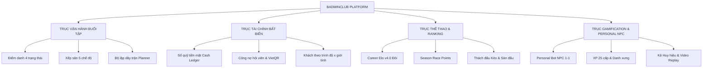
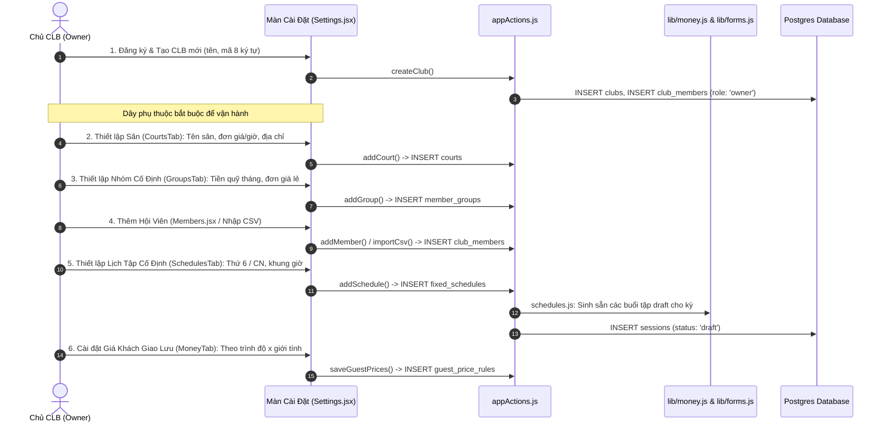
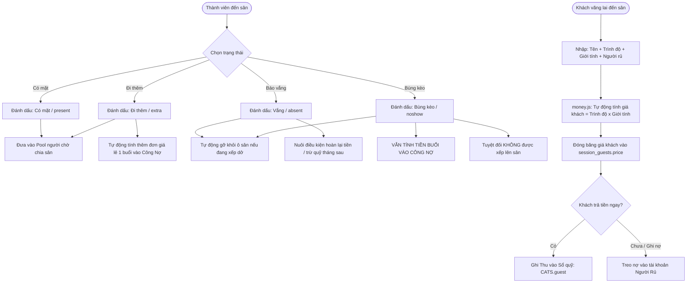
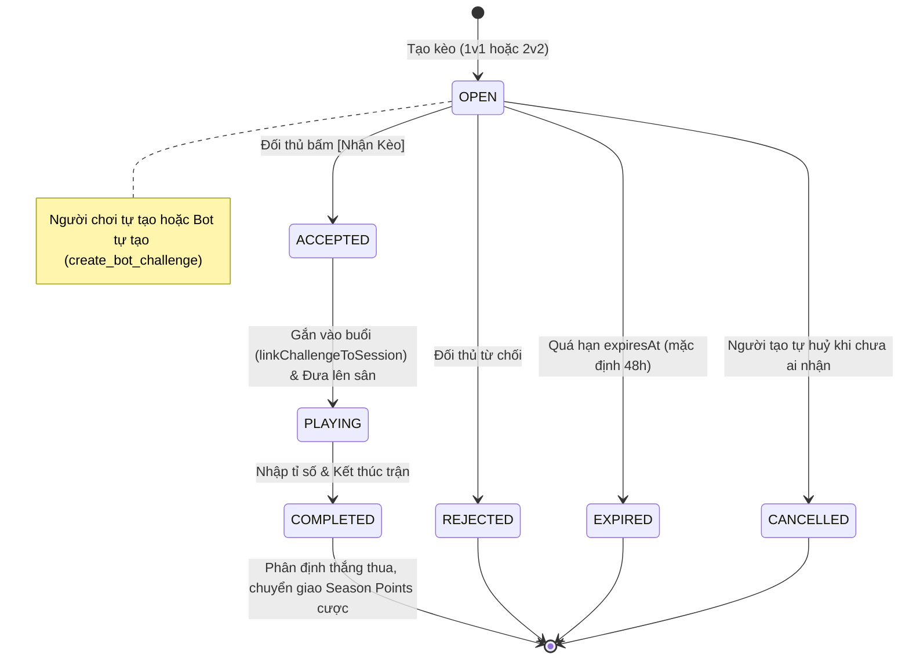
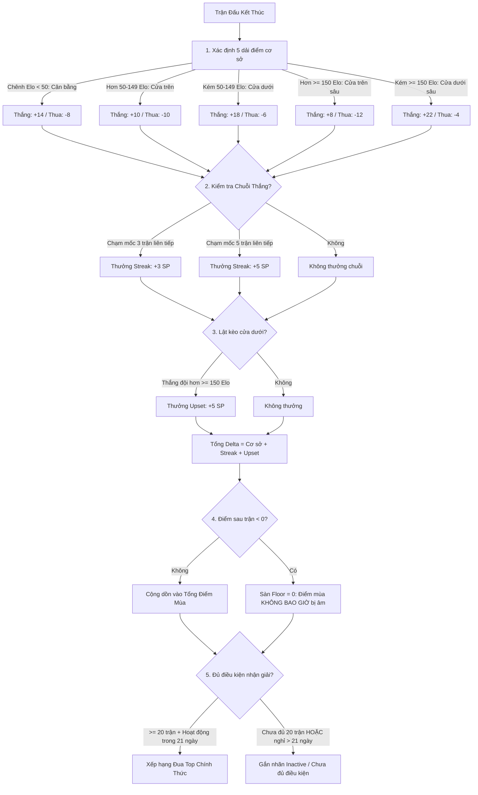
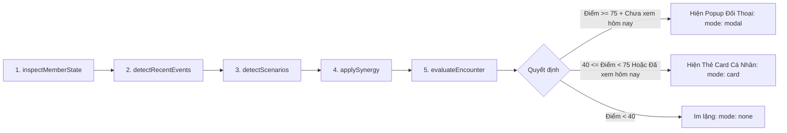
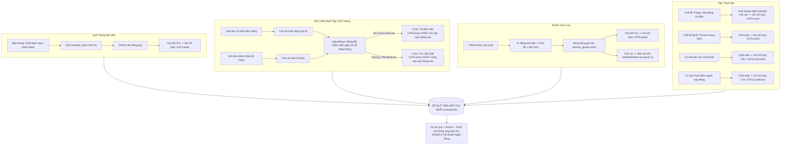

# TỔNG QUAN Ý TƯỞNG, KIẾN TRÚC & TOÀN BỘ LUỒNG LOGIC (MASTER SYSTEM LOGIC & FLOWS)

**Dự án:** Quản lý CLB Cầu Lông (Badminclub)  
**Tài liệu dành cho:** Developer mới, Product Architect, Contributor  
**Phiên bản hệ thống:** v6.9.0 / Engine v2.3 · **Cập nhật:** 2026-09-23

---

## MỤC LỤC

1. [Ý Tưởng Cốt Lõi & Triết Lý Thiết Kế](#1-ý-tưởng-cốt-lõi--triết-lý-thiết-kế)
2. [Nguyên Tắc Bất Di Bất Dịch (The Golden Rules)](#2-nguyên-tắc-bất-di-bất-dịch-the-golden-rules)
3. [Kiến Trúc Kỹ Thuật & Mô Hình Dữ Liệu](#3-kiến-trúc-kỹ-thuật--mô-hình-dữ-liệu)
4. [Bản Đồ 12 Luồng Nghiệp Vụ Đầu - Cuối (End-to-End Flows)](#4-bản-đồ-12-luồng-nghiệp-vụ-đầu---cuối-end-to-end-flows)
   - [Luồng 1: Khởi tạo CLB & Thiết lập Ban đầu (Onboarding Flow)](#luồng-1-khởi-tạo-clb--thiết-lập-ban-đầu-onboarding-flow)
   - [Luồng 2: Vòng đời Buổi tập (Session Lifecycle Flow)](#luồng-2-vòng-đời-buổi-tập-session-lifecycle-flow)
   - [Luồng 3: Điểm danh, Khách giao lưu & Sân bãi (Attendance & Guest Flow)](#luồng-3-điểm-danh-khách-giao-lưu--sân-bãi-attendance--guest-flow)
   - [Luồng 4: Xếp sân & Vận hành Thi đấu (Court Assignment & Match Flow)](#luồng-4-xếp-sân--vận-hành-thi-đấu-court-assignment--match-flow)
   - [Luồng 5: Phân hệ Lập Dây Trận Tự Động (Session Match Planner Flow)](#luồng-5-phân-hệ-lập-dây-trận-tự-động-session-match-planner-flow)
   - [Luồng 6: Hệ thống Kèo Đấu Thách Đấu (Challenge Engine Flow)](#luồng-6-hệ-thống-kèo-đấu-thách-đấu-challenge-engine-flow)
   - [Luồng 7: Hệ thống Đánh giá Trình độ & Elo (Career Elo v4.0 Engine Flow)](#luồng-7-hệ-thống-đánh-giá-trình-độ--elo-career-elo-v40-engine-flow)
   - [Luồng 8: Hệ thống Đua Top Mùa Giải (Season Points Race Engine Flow)](#luồng-8-hệ-thống-đua-top-mùa-giải-season-points-race-engine-flow)
   - [Luồng 9: Hệ thống Trợ lý Ảo NPC Cá nhân hóa (Personal Bot Scenario Engine v2.3 Flow)](#luồng-9-hệ-thống-trợ-lý-ảo-npc-cá-nhân-hóa-personal-bot-scenario-engine-v23-flow)
   - [Luồng 10: Hệ thống Tài chính, Công nợ & Sổ quỹ (Money, Dues & Ledger Flow)](#luồng-10-hệ-thống-tài-chính-công-nợ--sổ-quỹ-money-dues--ledger-flow)
   - [Luồng 11: Hệ thống Gamification (XP, Cấp bậc, Danh xưng & Kệ Huy hiệu Flow)](#luồng-11-hệ-thống-gamification-xp-cấp-bậc-danh-xưng--kệ-huy-hiệu-flow)
   - [Luồng 12: Thư viện Trận đấu, Video Replay Timeline & Ma trận H2H Flow](#luồng-12-thư-viện-trận-đấu-video-replay-timeline--ma-trận-h2h-flow)
5. [Cơ Chế Đồng Bộ & Lưu Trữ (Sync & Storage Architecture)](#5-cơ-chế-đồng-bộ--lưu-trữ-sync--storage-architecture)
6. [Bản Đồ Tra Cứu File Cho Developer Mới (Codebase Directory Map)](#6-bản-đồ-tra-cứu-file-cho-developer-mới-codebase-directory-map)
7. [Quy Trình Phát Triển, Kiểm Thử & Các Cạm Bẫy Cần Tránh](#7-quy-trình-phát-triển-kiểm-thử--các-cạm-bẫy-cần-tránh)

---

## 1. Ý TƯỞNG CỐT LÕI & TRIẾT LÝ THIẾT KẾ

### 1.1 Badminclub giải quyết bài toán gì?
Trong các CLB cầu lông phong trào tại Việt Nam (thường sinh hoạt 1–3 buổi/tuần, ví dụ T6 và Chủ Nhật), người làm chủ nhiệm/thủ quỹ/quản trò luôn đối mặt với 4 "nỗi đau" nhức nhối:
1. **Rối loạn điểm danh & chia sân:** Ai đến trước, ai đến sau? Ai đánh nhiều trận, ai ngồi chơi? Xếp cặp thế nào để không chênh lệch trình độ gây chán nản?
2. **Nhập nhèm tài chính:** Tiền sân, tiền cầu, quỹ tháng, thu bù người đi thêm, hoàn tiền người nghỉ, tiền khách giao lưu vãng lai.
3. **Thiếu động lực thi đấu & kết nối:** Đánh xong rồi về, không có bảng xếp hạng chuẩn xác, không có lịch sử đối đầu (H2H), không có ghi nhận thành tích.
4. **Trải nghiệm app khô khan:** Các phần mềm quản lý thông thường chỉ là bảng tính Excel nâng cấp, thiếu sinh khí và tính cộng đồng.

**Badminclub** ra đời để giải quyết toàn bộ 4 bài toán trên trong một nền tảng Web App duy nhất, hiện đại, mượt mà và đậm chất thể thao.

### 1.2 Bốn Trục Trải Nghiệm Cốt Lõi


---

## 2. NGUYÊN TẮC BẤT DI BẤT DỊCH (THE GOLDEN RULES)

Khi lập trình trên repo này, bạn **bắt buộc tuân thủ 5 nguyên tắc vàng** sau đây (vi phạm sẽ bị coi là lỗi kiến trúc nghiêm trọng):

### 🚨 NGUYÊN TẮC 0: CẤM TUYỆT ĐỐI XOÁ HOẶC RESET DATABASE
- **Nghiêm cấm chạy:** `supabase db reset`, `DROP DATABASE`, `DROP SCHEMA ... CASCADE`, `TRUNCATE`, `DELETE FROM ... WHERE true`.
- Mọi thay đổi dữ liệu hoặc cấu trúc bảng phải thực hiện qua migration tiến hành (`supabase/migrations/xxxx_*.sql`) và chạy `psql -f`.

### 🛡️ NGUYÊN TẮC 1: TÁCH BIỆT TUYỆT ĐỐI GIỮA TIỀN VÀ THỂ THAO
- **Tiền chỉ đổi tay qua Sổ quỹ (`transactions`).**
- Điểm danh, xếp sân, thắng thua trận đấu, chỉ số Elo, điểm mùa Season Points, kèo đấu thách đấu **tuyệt đối KHÔNG BAO GIỜ làm thay đổi số dư tiền quỹ**.
- Tiền sân chỉ được ghi nhận một lần (theo tháng hoặc theo buổi tùy chế độ cài đặt CLB). Không ghi nhận tiền sân lặp lại ở từng trận đấu.

### 🌐 NGUYÊN TẮC 2: KHÔNG HARD-CODE CHỮ HIỂN THỊ (100% QUA i18n)
- **Cấm viết chuỗi tiếng Việt trực tiếp trong component `.jsx`.** Mọi từ ngữ phải gọi `t('key', { params })` từ `#i18n` và lưu tại [`src/i18n/vi.json`](file:///c:/Workspace/badminclub/src/i18n/vi.json).
- Dữ liệu ghi vào database phải là **KEY hệ thống** (ví dụ: `dues`, `court`, `won`, `lost`, `active`), không bao giờ ghi nhãn hiển thị dịch thuật.

### ⚙️ NGUYÊN TẮC 3: KHÔNG SỐ MA THUẬT (100% QUA CONFIG)
- Tất cả hằng số nghiệp vụ (số phút mỗi ván, hệ số K Elo, mốc thưởng điểm mùa, dung sai cân bằng trình độ) phải nằm ở [`src/config/app.json`](file:///c:/Workspace/badminclub/src/config/app.json).
- Ma trận phân quyền 3 vai (`owner`, `treasurer`, `member`) nằm tập trung ở [`src/config/permissions.json`](file:///c:/Workspace/badminclub/src/config/permissions.json).

### 🧱 NGUYÊN TẮC 4: PHÂN LỚP KIẾN TRÚC NGHIÊM NGẶT
| Tầng | Thư mục | Trách nhiệm | Điều cấm kỵ |
| :--- | :--- | :--- | :--- |
| **Presentation** | `src/pages/*`, `src/components/*` | Đọc `db` từ `useApp()`, gọi selector từ `#lib/*`, gọi `a.<action>()` | Cấm tự `setDb()`, cấm tự tính tiền, cấm gọi fetch mạng |
| **Action Hub** | `src/contexts/appActions.js` | Nơi **DUY NHẤT** được ghi state và bắn thông báo Toast | Cấm chứa công thức tính toán tiền phức tạp |
| **Pure Logic** | `src/lib/*`, `src/utils/*` | Hàm thuần toán học: `(db, args) => result` | Cấm `setState`, cấm import React, cấm gọi mạng |
| **Storage / Network** | `src/contexts/storage.js` | Điểm chạm mạng duy nhất với Supabase | Cấm chứa nghiệp vụ |
| **Mapper** | `src/contexts/dbmap.js` | Chuyển đổi dữ liệu 2 chiều Client State $\leftrightarrow$ Postgres DB | Cấm gọi mạng, cấm import React |

---

## 3. KIẾN TRÚC KỸ THUẬT & MÔ HÌNH DỮ LIỆU

### 3.1 Công Nghệ Lựa Chọn (Tech Stack)
- **Frontend Core:** Vite 8 + React 19.2 (JavaScript thuần `.jsx` để chạy test bằng `node` trực tiếp không cần build transpile).
- **Styling:** CSS thuần + Design System TDMS (bản quyền trích xuất tại `src/components/ds/`), Dark/Light mode chuẩn token.
- **Routing:** React Router 7 hỗ trợ deep-linking URL (`/buoi-tap/:id`, `/thong-ke`, `/ca-nhan`).
- **Database & Auth:** Supabase (PostgreSQL 15+, Supabase Auth, Row Level Security RLS cho mọi bảng).
- **Testing:** Runner sẵn có `node --test` + `node:assert/strict` (không dùng Jest/Vitest để bảo đảm tốc độ thực thi tức thì và độc lập).

### 3.2 Ba Khái Niệm Phân Biệt Sống Còn
```text
┌─────────────────────────┐          ┌─────────────────────────┐
│     auth.users          │          │        clubs            │
│ (Hệ thống Auth Supabase)│          │ (CLB Cầu lông cụ thể)   │
└────────────┬────────────┘          └────────────┬────────────┘
             │ 1-1                                │ 1-n
             ▼                                    ▼
┌─────────────────────────┐          ┌─────────────────────────┐
│        profiles         │          │      club_members       │
│  (Hồ sơ tài khoản ngoài)│          │ (Hội viên TRONG một CLB)│
└─────────────────────────┘          └─────────────────────────┘
                                                  ▲
                                                  │ user_id (CÓ THỂ NULL)
                                                  │
                                     Chủ CLB tạo trước bằng tay.
                                     Khi hội viên đăng ký tài khoản,
                                     chủ CLB thực hiện Ghép tài khoản (Link).
```

1. **`profiles` (Tài khoản người dùng):** Gắn 1-1 với `auth.users`. Tồn tại độc lập với bất kỳ CLB nào. Lưu thông tin cá nhân chung: email, username, số điện thoại, avatar URL.
2. **`clubs` (Một CLB):** Có mã định danh 8 ký tự, cấu hình riêng (thang trình độ, giá sân, quỹ mở đầu, luật ghép tài khoản).
3. **`club_members` (Hội viên trong một CLB):** Thuộc về 1 CLB cụ thể. 
   - **`user_id` CÓ THỂ NULL:** Đây là trạng thái bình thường! Chủ nhiệm có thể tạo danh sách 50 thành viên để điểm danh và tính tiền trước, người chơi không cần tải app ngay.
   - Khi người chơi tải app, Chủ nhiệm thực hiện **Ghép tài khoản** (`linkMemberUser`) chọn lọc trong 6 trường: `name`, `fullName`, `phone`, `email`, `gender`, `level`.
   - Một tài khoản (`user_id`) có thể tham gia nhiều CLB khác nhau với các vai trò (`role`) và trình độ (`level`) hoàn toàn khác nhau.

---

## 4. BẢN ĐỒ 12 LUỒNG NGHIỆP VỤ ĐẦU - CUỐI (END-TO-END FLOWS)

---

### LUỒNG 1: KHỞI TẠO CLB & THIẾT LẬP BAN ĐẦU (ONBOARDING FLOW)



**Chi tiết then chốt:**
- Thang trình độ (`levels`) mặc định: Yếu $\rightarrow$ Trung Bình Yếu $\rightarrow$ Trung Bình $\rightarrow$ Trung Bình Khá $\rightarrow$ Khá $\rightarrow$ Khá Tốt $\rightarrow$ Tốt.
- Thứ tự của mảng trình độ trong database chính là thứ tự toán học dùng cho việc xếp sân cân bằng.

---

### LUỒNG 2: VÒNG ĐỜI BUỔI TẬP (SESSION LIFECYCLE FLOW)

Một buổi tập trải qua 4 trạng thái tuần tự chặt chẽ:
```text
┌─────────────────┐       Mở buổi tập       ┌─────────────────┐
│     DRAFT       │ ──────────────────────> │      OPEN       │
│  (Chưa mở)      │                         │    (Đang mở)    │
└─────────────────┘                         └────────┬────────┘
         │                                           │
         │ Huỷ buổi                                  │ Chốt buổi (Lock)
         ▼                                           ▼
┌─────────────────┐                         ┌─────────────────┐
│   CANCELLED     │                         │     CLOSED      │
│    (Đã huỷ)     │                         │    (Đã chốt)    │
└─────────────────┘                         └─────────────────┘
```

1. **`draft` (Chưa mở):** Được sinh tự động từ Lịch cố định (`fixed_schedules`). Chưa phát sinh tiền sân, chưa thể điểm danh.
2. **`open` (Đang mở):**
   - Chủ nhiệm hoặc Quản trò bấm **"Mở buổi tập"** (`openSession`).
   - Mở cổng điểm danh thành viên cố định, thêm khách giao lưu, bắt đầu chia sân và ghi nhận trận đấu.
3. **`closed` (Đã chốt):**
   - Bấm **"Chốt buổi tập"** (`closeSession`) khi kết thúc giờ đánh.
   - **Hành động cốt lõi:** Đóng băng đơn giá tiền sân vào dòng `session_courts.cost` tại thời điểm đó (để sau này chủ sân có tăng giá thì số liệu quá khứ không bị sai lệch).
   - Tự động ghi sổ quỹ các dòng: tiền bán sân dư cho CLB khác (Ghi Thu), tiền thuê thêm sân phát sinh ngoài hợp đồng tháng (Ghi Chi).
   - Khóa vĩnh viễn các thao tác sửa đổi nhạy cảm trên buổi tập này.
4. **`cancelled` (Đã huỷ):** Dùng khi nghỉ lễ hoặc sự cố sân. Buổi này tự động bị loại khỏi mẫu số khi chia đơn giá tháng của hội viên.

---

### LUỒNG 3: ĐIỂM DANH, KHÁCH GIAO LƯU & SÂN BÃI (ATTENDANCE & GUEST FLOW)



**Quy tắc đặc thù:**
- **Bùng kèo (`noshow`):** Phạt nghiêm khắc: Vẫn phải chịu chi phí buổi chơi (để công bằng với người khác cùng gánh tiền sân), nhưng bị gỡ khỏi sân và không được thi đấu ván nào.
- **Hai đường đi lẻ:** Thành viên CLB đi thêm buổi khác nhóm thì thêm vào mục *Người đi lẻ* (tính đơn giá hội viên). Người lạ ngoài CLB bắt buộc thêm vào mục *Khách giao lưu* (tính theo bảng giá khách).

---

### LUỒNG 4: XẾP SÂN & VẬN HÀNH THI ĐẤU (COURT ASSIGNMENT & MATCH FLOW)

```mermaid
graph TD
    A[Pool Người Chờ Điểm Danh] --> B{Phương thức chia sân}
    
    B -->|Thủ công| C[Chạm / Kéo thả người vào ô trống trên sân]
    B -->|Xếp thông minh 5 chế độ| D[Thuật toán lib/assign.js]
    B -->|Bộ lập dây trận| E[lib/planner.js: Phân bổ theo Rounds]
    B -->|Kèo thách đấu| F[lib/challenge.js: Đưa kèo ACCEPTED lên sân]

    D --> D1[1. Cân bằng trình độ: Tối thiểu chênh lệch level đôi bên]
    D --> D2[2. Giao lưu ghép cặp: Ưu tiên người chưa từng đánh cặp với nhau]
    D --> D3[3. Phân tầng: Tách người giỏi đánh riêng, người mới đánh riêng]
    D --> D4[4. Ưu tiên ván ít: Đẩy người đánh ít trận nhất vào sân trước]
    D --> D5[5. Xếp nhanh: Lấy ngẫu nhiên người rảnh ghép vào]

    C & D & E & F --> G[Đủ 4 người 2v2 hoặc 2 người 1v1 trên sân]
    G --> H[useClock.js: Bấm giờ thi đấu sân]
    H --> I[Kết thúc trận: Nhập tỉ số]

    I -->|Cách 1: Thủ công| J[Nhập điểm set 1, set 2, set 3]
    I -->|Cách 2: Giọng nói AI| K[voiceMatchParser.js: Phân tích khẩu lệnh giọng nói]

    J & K --> L[appActions.js: recordMatch()]
    L --> M[KÍCH HOẠT HỆ THỐNG XỬ LÝ ĐA TẦNG]
    M --> M1[1. Elo Engine: Tính delta & cập nhật Career Elo]
    M --> M2[2. Season Race: Tính SP, thưởng streak/upset, cập nhật BXH]
    M --> M3[3. XP Engine: Cộng điểm kinh nghiệm & kiểm tra lên cấp]
    M --> M4[4. Badge Engine: Kiểm tra mở khóa huy hiệu]
    M --> M5[5. Activity Feed: Bắn tin sự kiện mạng xã hội kèm narrative]
    M --> M6[6. Personal Bot: Ghi nhận biến động cho kịch bản đối thoại]
```

---

### LUỒNG 5: PHÂN HỆ LẬP DÂY TRẬN TỰ ĐỘNG (SESSION MATCH PLANNER FLOW)

Khi số lượng người đông (15–30 người) trên 2–3 sân, việc xếp từng trận dễ dẫn đến tình trạng "kẻ đánh liên tục đứt hơi, người ngồi chờ dài cổ". **Planner Engine (`src/lib/planner.js`)** giải quyết triệt để:

1. **Khởi tạo kế hoạch (Generate Plan):**
   - Đọc danh sách tất cả hội viên và khách đang có mặt (`present`).
   - Chia buổi tập thành các **Vòng đấu (Rounds)** (ví dụ: Round 1, Round 2, Round 3). Mỗi vòng tương ứng với số sân hoạt động đồng thời.
2. **Thuật toán Tối ưu hóa đa mục tiêu:**
   - **Hạn ngạch công bằng (Match Quota):** Mọi người đều có số trận dự kiến bằng nhau ($\pm 1$).
   - **Nghỉ ngơi hồi phục (Rest Balance):** Không để ai phải đánh 3 trận liên tiếp; không để ai ngồi ngoài quá 2 vòng liên tiếp.
   - **Xử lý nguyện vọng (Preferences):** Cho phép đặt điều kiện (ví dụ: "A và B muốn đánh cặp chung", "C muốn về sớm trước 21:00").
   - **Tích hợp Kèo thách đấu:** Các kèo đấu `ACCEPTED` được ưu tiên chiếm slot cố định trong vòng đấu phù hợp.
3. **Thực thi trên sân:** Quản trò chỉ việc bấm *"Bắt đầu Vòng X"*, hệ thống tự động đẩy toàn bộ danh sách lên các sân tương ứng.

---

### LUỒNG 6: HỆ THỐNG KÈO ĐẤU THÁCH ĐẤU (CHALLENGE ENGINE FLOW)

Kèo đấu mang lại sự kịch tính và tạo "nhiệt" cho CLB.



#### Hai Thuật Toán Tự Tạo Kèo Của Bot CLB (`create_bot_challenge`):
1. **`rank_neighbor` (Sát nút BXH):** Quét thấy 2 người chơi đang cách nhau $\le 15$ điểm Elo hoặc sát nhau trên bảng xếp hạng mà chưa gặp nhau trong 2 tuần gần nhất $\rightarrow$ Bot tự tạo kèo ghép 2 người với thông điệp: *"Hai cao thủ ngang cơ đang bám đuổi nhau, lên sân phân định thứ hạng!"*.
2. **`streak_hunt` (Săn chuỗi):** Khi một thành viên đạt chuỗi 4 hoặc 5 trận thắng liên tiếp $\rightarrow$ Bot tự tìm kiếm một đối thủ kỵ rơ hoặc có Elo cửa trên để tạo kèo thách đấu nhằm mục đích "cắt chuỗi".
3. **Cược Điểm Mùa (Season Points Wagering):** Hai bên có thể cược điểm mùa (SP). Bên thắng nhận toàn bộ số điểm cược của bên thua.

---

### LUỒNG 7: HỆ THỐNG ĐÁNH GIÁ TRÌNH ĐỘ & ELO (CAREER ELO v4.0 ENGINE FLOW)

Đặc tả toán học đầy đủ nằm tại [`src/lib/rating.js`](file:///c:/Workspace/badminclub/src/lib/rating.js) và [`docs/CHI_SO_VA_CONG_THUC.md`](file:///c:/Workspace/badminclub/docs/CHI_SO_VA_CONG_THUC.md).

#### 1. Công thức Elo Đôi (Doubles Elo)
Elo của một đội (Team Elo) là trung bình cộng có trọng số của 2 thành viên:
$$R_{team} = \frac{R_1 + R_2}{2}$$
Xác suất thắng kỳ vọng của Đội A trước Đội B:
$$E_A = \frac{1}{1 + 10^{(R_{teamB} - R_{teamA}) / 400}}$$

#### 2. Hệ số K Động (Dynamic K-Factor)
Tùy thuộc vào số trận đã đấu của người chơi để điểm số hội tụ nhanh lúc đầu và ổn định dần về sau:
- **Người mới ($< 10$ trận):** $K = 40$ (Biên độ dao động lớn để nhanh chóng tìm đúng trình độ thật).
- **Hội viên thường ($10 - 30$ trận):** $K = 28$.
- **Kỳ cựu ($> 30$ trận):** $K = 16$ (Điểm số rất ổn định, khó bị cày điểm).

#### 3. Hệ số Cách Biệt Tỉ Số (Margin of Victory Multiplier - MOV)
Thắng suýt sao 21-19 khác hoàn toàn với thắng áp đảo 21-5:
$$MOV = \ln(|S_A - S_B| + 1) \times \frac{2.2}{(R_{winner} - R_{loser}) \times 0.001 + 2.2}$$
$$\Delta R = K \times (Actual - E) \times MOV$$

#### 4. Thước đo Độ Tin Cậy (Confidence R1 - R5)
Hệ thống gắn chip độ tin cậy bên cạnh điểm Elo để chống gian lận nick ảo:
- **R1 (Chưa xác định):** $1 - 4$ trận.
- **R2 (Sơ bộ):** $5 - 9$ trận.
- **R3 (Tạm tin cậy):** $10 - 19$ trận.
- **R4 (Độ tin cậy cao):** $20 - 39$ trận.
- **R5 (Chuẩn xác tuyệt đối):** $\ge 40$ trận.

#### 5. Replay Rating Cascade (Tính lại chuỗi theo thời gian thực)
Nếu Quản trò sửa lại tỉ số của một trận đấu diễn ra từ tuần trước, hàm `replayRatingCascade()` sẽ tự động chạy lại toàn bộ các trận đấu diễn ra sau mốc thời gian đó theo đúng thứ tự thời gian để đảm bảo điểm Elo hiện tại luôn đúng 100%.

---

### LUỒNG 8: HỆ THỐNG ĐUA TOP MÙA GIẢI (SEASON POINTS RACE ENGINE FLOW)

Nếu Career Elo là thước đo **trình độ kỹ thuật lâu dài**, thì **Season Points (SP)** là thước đo **phong độ và sự tích cực trong mùa giải** (reset định kỳ theo quý/năm).



**Nhân vật Thợ Săn Tiền Thưởng (Bounty Player):**
- Bất kỳ ai đang có chuỗi thắng $\ge 4$ trận sẽ bị hệ thống gắn icon "Bounty".
- Bất kỳ ai đánh bại người này trong trận tiếp theo sẽ nhận thêm **+10 SP tiền thưởng**.

---

### LUỒNG 9: HỆ THỐNG TRỢ LÝ ẢO NPC CÁ NHÂN HÓA (PERSONAL BOT SCENARIO ENGINE v2.3 FLOW)

Trong mỗi CLB, Bot không chỉ là một cái tên vô hồn chiếm 1 chỗ trên bảng xếp hạng, mà là một **Personal NPC** có tính cách, biết chúc mừng, biết "cà khịa", biết gạ kèo và ghi nhớ mọi món nợ đối đầu của từng người chơi.

#### Pipeline 5 Bước Xử Lý Của Scenario Engine:


#### Chi Tiết 5 Bước Trong Code ([`src/lib/botScenarios.js`](file:///c:/Workspace/badminclub/src/lib/botScenarios.js)):
1. **`inspectMemberState(db, memberId, now, memoryStore)`**: Thu thập toàn bộ trạng thái toán học: Elo hiện tại, Elo trước trận gần nhất (`preMatchElo`), Thứ hạng trước trận (`preRank`), Chuỗi thắng/thua, Đối thủ kình địch H2H (`rival`), và kiểm tra tính tươi mới của buổi tập (`isMatchSessionFresh`).
2. **`detectRecentEvents(db, memberId, state, now)`**: Trích xuất các sự kiện thực tế có gắn `eventKey` bắt buộc:
   - `overtake_rival`: Vượt điểm đối thủ cạnh tranh nhờ trận vừa thắng.
   - `overtaken_by_rival`: Bị đối thủ vượt mặt.
   - `revenge_complete`: Đòi nợ thành công! (Trận trước thua đối thủ này, trận này vừa thắng lại, và khoảng cách giữa 2 trận $\le 6$ trận của người chơi).
   - `chasing_bot`: Vừa bước vào vùng bám đuổi sát nút Bot ($\le 15$ Elo qua trận thắng gần nhất).
   - `top3_entered`: Chuyển đổi thứ hạng toán học thực sự (`preRank > 3` và `currentRank <= 3`).
   - `near_streak_5`: Thắng trận thứ 4 liên tiếp, chỉ còn cách mốc 5 đúng 1 trận.
3. **`detectScenarios(events, state)`**: Chuyển các sự kiện thô thành các kịch bản đối thoại kèm độ ưu tiên (`baseScore`) và sắc thái (`tone`: *competitive*, *mocking*, *praise*, *mentor*, *challenge*).
4. **`applySynergy(candidates, state)`**: **Quy tắc vàng:** Chỉ gom các kịch bản có **CÙNG `eventKey`** (xảy ra trong cùng một trận đấu). Ví dụ: Vừa thắng chuỗi 3 + Vừa vượt mặt Bot trong cùng 1 trận $\rightarrow$ Gom thành kịch bản Siêu phẩm *Synergy Streak & Overtake*. Tuyệt đối không gom các chuyện xảy ra khác thời điểm.
5. **`evaluateEncounter(candidates, memberId, now, memoryStore)`**:
   - Áp dụng trừ điểm trôi dạt theo thời gian (`elapsed`).
   - Phạt trừ điểm nếu kịch bản này đã từng xuất hiện gần đây (`hasShownRecently`).
   - **Daily Modal Cap:** Kiểm tra `hasSeenModalToday(memberId)`. Mỗi ngày một người chơi **chỉ được bật Popup Modal tối đa 1 lần** để chống spam khó chịu; các kịch bản sau trong ngày tự động hạ cấp xuống dạng Card trên trang Thống Kê.

#### Cơ Chế Session-Aware Freshness (Thông Minh Theo Nhịp CLB):
- Không dùng mốc 24h cứng nhắc khiến người chơi bận việc đầu tuần bị lỡ mất khoảnh khắc tương tác.
- Trận đấu ngày Thứ 6 hoặc Chủ Nhật được xem là **Tươi Mới** cho tới khi **buổi tập tiếp theo của CLB diễn ra** (chưa có buổi mới `closed`, chưa có trận mới sau $>6$ tiếng, trần tối đa 7 ngày).
- Khi người chơi mở app vào Thứ 2, Thứ 3 hay Thứ 4 (First Encounter), Bot lập tức xuất hiện phản hồi sắc sảo về buổi đánh gần nhất. Ngay sau khi xem xong, trạng thái được lưu vào `BotMemoryStore` để các lần mở app/F5 sau không lặp lại.

#### Giao Diện Đối Thoại NPC 1-1 (`BotEncounterModal.jsx`):
- Thiết kế chuẩn TDMS: Avatar Bot phát sáng hào quang theo sắc thái, bong bóng thoại NPC trỏ thẳng vào Bot, Tone Badge sinh động.
- Nút bấm ngữ cảnh thông minh: *[Gạ kèo đòi nợ]* $\rightarrow$ mở modal thách đấu; *[Xem BXH]* $\rightarrow$ chuyển tab Leaderboard; *[Đập cầu với Bot]* $\rightarrow$ mở Minigame Arcade mini.

---

### LUỒNG 10: HỆ THỐNG TÀI CHÍNH, CÔNG NỢ & SỔ QUỸ (MONEY, DUES & LEDGER FLOW)

Đây là phân hệ cốt lõi để giữ sự minh bạch tài chính của CLB. Chi tiết mã nguồn nằm tại [`src/lib/money.js`](file:///c:/Workspace/badminclub/src/lib/money.js) và [`src/lib/ledger.js`](file:///c:/Workspace/badminclub/src/lib/ledger.js).



**Thanh toán thông minh VietQR:**
- Mọi khoản công nợ (quỹ tháng, tiền khách, nợ đi thêm) đều có nút **[Mã QR Thanh Toán]**.
- Hệ thống sinh mã QR chuẩn NAPAS 247 (`src/utils/vietqr.js`) kèm cấu hình ngân hàng CLB và cú pháp chuyển khoản định danh (`Mã thành viên + Nội dung`), thủ quỹ quét đối soát tức thì.

---

### LUỒNG 11: HỆ THỐNG GAMIFICATION (XP, CẤP BẬC, DANH XƯNG & KỆ HUY HIỆU FLOW)

Chi tiết mã nguồn tại [`src/lib/xp.js`](file:///c:/Workspace/badminclub/src/lib/xp.js) và [`src/lib/badges.js`](file:///c:/Workspace/badminclub/src/lib/badges.js).

#### 1. Trục Gắn Bó & Điểm Cống Hiến (XP Engine)
Khác với Elo (chỉ đo trình độ thắng/thua), **XP đo lòng trung thành và sự nhiệt tình** với CLB:
- Điểm danh có mặt mỗi buổi: **+20 XP**.
- Tham gia mỗi trận đấu (bất kể thắng/thua): **+10 XP**.
- Thâm niên gắn bó với CLB: **+50 XP / mỗi tháng**.
- Rủ thêm 1 khách giao lưu tới sân: **+15 XP**.

#### 2. Hệ Thống 25 Cấp Bậc & 6 Danh Xưng (Honor Titles):
- Cấp $1 - 4$: **Tân Thủ**
- Cấp $5 - 9$: **Tập Sự**
- Cấp $10 - 14$: **Phong Trào**
- Cấp $15 - 19$: **Nòng Cốt**
- Cấp $20 - 24$: **Kỳ Cựu**
- Cấp $25+$: **Huyền Thoại CLB**

#### 3. Bộ Sưu Tập Huy Hiệu (Badge Shelf):
Hội viên có thể ghim 3 huy hiệu danh giá nhất lên hồ sơ cá nhân:
- **Huy hiệu Thành tích (Achievement Badges):** *Bất Bại* (thắng 5 trận liên tiếp), *Thợ Săn Khủng Long* (hạ gục người hơn 200 Elo), *Ong Chăm Chỉ* (đi đủ 100% buổi trong tháng), *Chiến Binh Bền Bỉ* (đánh $>8$ trận trong 1 buổi).
- **Huy hiệu Phong Cách (Playstyle Badges):** *Pháo Binh Đập Cầu*, *Bức Tường Thủ Lưới*, *Nhạc Trưởng Điều Cầu*.

---

### LUỒNG 12: THƯ VIỆN TRẬN ĐẤU, VIDEO REPLAY TIMELINE & MA TRẬN H2H FLOW

Chi tiết tại [`src/pages/Matches.jsx`](file:///c:/Workspace/badminclub/src/pages/Matches.jsx) và [`src/lib/matchSearch.js`](file:///c:/Workspace/badminclub/src/lib/matchSearch.js).

1. **Thư viện trận đấu & Video Replay:**
   - Mỗi trận đấu có thể gắn kèm link Video (YouTube / MP4).
   - **Video Timeline Editor:** Quản trò hoặc người xem có thể tạo các mốc thời gian (Timeline Tags) cho các pha cầu đáng nhớ: *Pha cầu bền 45 chạm (Rally)*, *Pha đập cầu cắm vạch*, *Pha cứu cầu không tưởng*, *Match Point quyết định*.
   - Người xem bấm vào tag để tua video trực tiếp đến giây diễn ra pha bóng.
2. **Ma trận Đối đầu Toàn diện (H2H Matrix):**
   - Tra cứu lịch sử đối đầu giữa bất kỳ 2 người chơi nào trong CLB: tỉ số đối đầu (W-L), chuỗi gặp nhau, chênh lệch điểm số trung bình.
   - **Cặp đôi ăn ý (Pairs Ranking & Pair H2H):** Xếp hạng các cặp đôi có tỉ lệ thắng cao nhất khi đứng chung sân và lịch sử đối đầu giữa Cặp A-B vs Cặp C-D.

---

## 5. CƠ CHẾ ĐỒNG BỘ & LƯU TRỮ (SYNC & STORAGE ARCHITECTURE)

```text
┌─────────────────────────────────────────────────────────────┐
│                       REACT APP                             │
│                                                             │
│  [ UI Component ] ──( gọi action )──> [ appActions.js ]     │
│                                               │             │
│                                           ( setDb )         │
│                                               ▼             │
│                                       [ AppContext.jsx ]    │
│                                         ( state: db )       │
│                                               │             │
│                                       ( debounce 1.5s )     │
│                                               ▼             │
│                                       [ storage.js: save ]  │
└───────────────────────────────────────────────┼─────────────┘
                                                │
                                       ( dbmap.diff(db) )
                                                │ Chỉ gửi các dòng THAY ĐỔI
                                                ▼
┌─────────────────────────────────────────────────────────────┐
│                      SUPABASE BACKEND                       │
│                                                             │
│       [ PostgREST API ] ──( RLS Security Check )──┐         │
│                                                   ▼         │
│                                          [ PostgreSQL DB ]  │
└─────────────────────────────────────────────────────────────┘
```

1. **Cơ chế nạp (`load` / `reload`):**
   - Khi chọn CLB, `storage.load(clubId)` nạp toàn bộ dữ liệu từ các bảng Postgres qua Supabase Client.
   - `dbmap.toDb()` chuyển đổi dữ liệu phẳng nhiều bảng thành cây đối tượng `db` duy nhất trong `AppContext`.
2. **Cơ chế ghi thông minh (Diff-based Save):**
   - Ứng dụng **không bao giờ ghi đè toàn bộ DB**.
   - `dbmap.diff(newDb, oldDb)` so sánh cây state mới và cũ để trích xuất danh sách các bản ghi thực sự bị thêm (`inserts`), sửa (`updates`) hoặc xóa (`deletes`).
   - `storage.save()` thực hiện các lệnh `upsert` / `delete` tương ứng xuống Supabase với cơ chế gom nhóm (batching).
3. **Chống mất kết nối & Khả năng hoạt động bền bỉ:**
   - Nếu mất mạng, state client vẫn phản hồi mượt mà. Khi có mạng trở lại, tiến trình lưu ngầm sẽ tự động hoàn tất.

---

## 6. BẢN ĐỒ TRA CỨU FILE CHO DEVELOPER MỚI (CODEBASE DIRECTORY MAP)

Khi cần phát triển hoặc sửa một tính năng cụ thể, bạn chỉ cần tra bảng dưới đây để mở đúng file:

| Tính năng cần tìm | File Logic Thuần (`#lib/*`) | File Action Ghi (`contexts/`) | File Giao Diện (`pages/*` & `components/*`) |
| :--- | :--- | :--- | :--- |
| **Tiền quỹ, Công nợ, Giá khách** | `src/lib/money.js` | `src/contexts/appActions.js` | `src/pages/Debts.jsx`, `src/components/ui/MyDebtPanel.jsx` |
| **Sổ quỹ tiền mặt** | `src/lib/ledger.js` | `src/contexts/appActions.js` | `src/pages/Fund.jsx` |
| **Điểm danh & Buổi tập** | `src/lib/money.js`, `schedules.js` | `src/contexts/appActions.js` | `src/pages/SessionDetail.jsx`, `src/pages/Sessions.jsx` |
| **Chia sân (5 chế độ)** | `src/lib/assign.js` | `src/contexts/appActions.js` | `src/components/session/CourtAssignmentTab.jsx` |
| **Lập dây trận (Planner)** | `src/lib/planner.js` | `src/contexts/appActions.js` | `src/components/session/PlannerModal.jsx` |
| **Career Elo Rating** | `src/lib/rating.js` | `src/contexts/appActions.js` | `src/pages/Leaderboard.jsx` (`CareerEloTab`) |
| **Đua Top Mùa Giải (SP)** | `src/lib/season.js` | `src/contexts/appActions.js` | `src/pages/Leaderboard.jsx` (`SeasonRaceTab`) |
| **Kèo đấu thách đấu** | `src/lib/challenge.js` | `src/contexts/appActions.js` | `src/components/challenge/*` |
| **Personal Bot NPC (v2.3)** | `src/lib/botScenarios.js`, `botMemory.js`, `bot.js` | `src/contexts/appActions.js` | `src/components/bot/BotEncounterModal.jsx`, `MyStats.jsx` |
| **XP, Cấp bậc, Danh xưng** | `src/lib/xp.js` | `src/contexts/appActions.js` | `src/pages/Profile.jsx`, `src/pages/MyStats.jsx` |
| **Huy hiệu & Thành tích** | `src/lib/badges.js` | `src/contexts/appActions.js` | `src/pages/Badges.jsx` |
| **Video Replay & Timeline** | `src/lib/matchSearch.js` | `src/contexts/appActions.js` | `src/pages/Matches.jsx`, `MatchVideoPlayerModal.jsx` |
| **Đồng bộ Database** | — | `src/contexts/storage.js`, `dbmap.js` | `src/contexts/AppContext.jsx` |
| **Chữ hiển thị (i18n)** | `src/i18n/index.js` | — | `src/i18n/vi.json` |
| **Hằng số & Phân quyền** | — | — | `src/config/app.json`, `permissions.json` |

---

## 7. QUY TRÌNH PHÁT TRIỂN, KIỂM THỬ & CÁC CẠM BẪY CẦN TRÁNH

### 7.1 Cách Chạy Kiểm Thử (Unit Tests)
Hệ thống sử dụng test runner tích hợp sẵn của Node.js:
```bash
# Chạy toàn bộ 422+ bài test của toàn bộ hệ thống
npm test

# Chạy một file test cụ thể khi đang phát triển
node src/__tests__/lib/bot_scenarios.test.js
node src/__tests__/money/dues.test.js
node src/__tests__/money/claims.test.js
```

### 7.2 Bộ Số Chuẩn & Kiểm Thử Backtest (`npm run backtest`)
- Thư mục `src/__tests__/backtest/data/` lưu trữ lịch sử hàng nghìn trận đấu thật của CLB.
- Thư mục `baseline/` lưu mốc kết quả Elo và Điểm Mùa chuẩn.
- **Quy tắc vàng:** Bất kỳ sự thay đổi nào trong công thức tính Elo hoặc Điểm Mùa bắt buộc phải chạy:
  ```bash
  npm run backtest
  ```
  Nếu kết quả đổi khác với mốc $\rightarrow$ Test sẽ báo ĐỎ. Bạn phải kiểm tra chi tiết ai đổi, đổi bao nhiêu điểm, giải trình với chủ dự án trước khi được phép cập nhật baseline (`--save`).

### 7.3 Những Cạm Bẫy Phổ Biến (Common Traps & Gotchas)
1. **Quên `// i18n-ok` khi viết chuỗi đặc biệt:** Bộ test `smoke/i18n.test.js` quét toàn bộ codebase. Nếu bạn viết chuỗi tiếng Việt trần trong code mà không qua `t('key')` hoặc không đánh dấu `// i18n-ok`, test sẽ thất bại ngay lập tức.
2. **Cộng nhầm tầng tiền:** Nhắc lại: Chỉ có Sổ Quỹ (`transactions`) là nơi tiền thực tế đổi tay. Không ghi thêm chi phí sân vào từng trận đấu hay từng lần bấm giờ.
3. **Thêm alias trong `vite.config.js`:** Tuyệt đối không thêm alias riêng vào Vite vì `node --test` không hiểu được cấu hình của Vite. Chỉ sử dụng subpath imports `#lib/*`, `#ui`, `#ds`, `#i18n` đã khai báo chuẩn trong `package.json`.
4. **Nhầm lẫn giữa `profiles` và `club_members`:** Đổi tên hội viên trong CLB không làm đổi tên profile tài khoản ngoài của họ, và ngược lại.

---
*Tài liệu này là nguồn sự thật (Single Source of Truth) cao nhất về mặt kiến trúc và luồng nghiệp vụ của Badminclub. Hãy giữ tài liệu này luôn cập nhật khi có bất kỳ quyết định kiến trúc lớn nào được thông qua.*
